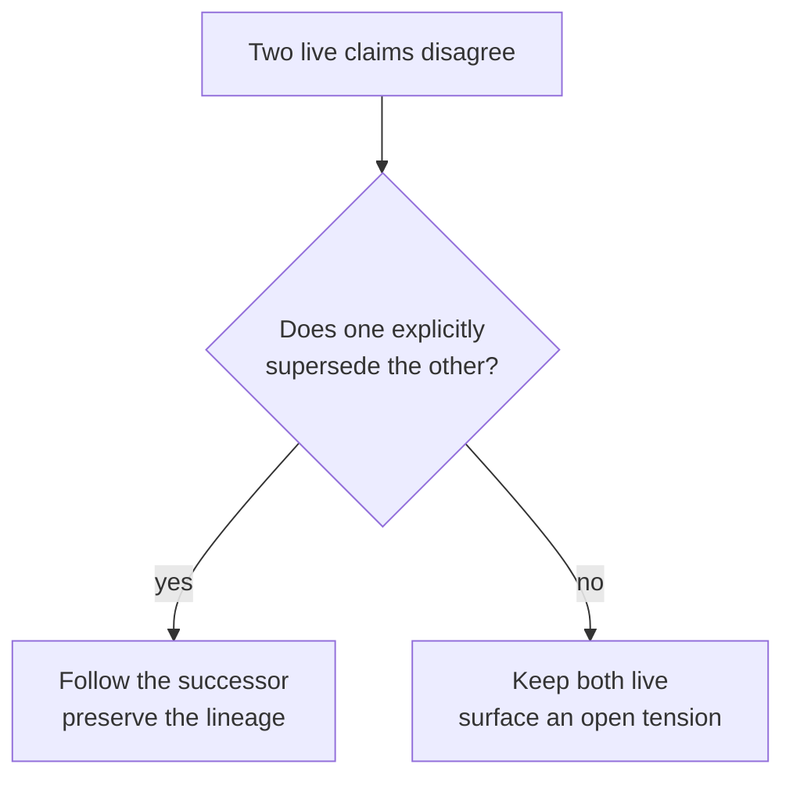

# Daftari

[](https://github.com/mavaali/daftari/actions/workflows/ci.yml) [](https://www.npmjs.com/package/daftari) [](LICENSE)

**Durable, inspectable memory for AI agents.** Daftari exposes a markdown vault
over the Model Context Protocol (MCP), then adds the controls an agent needs to
use that vault without flattening its history: provenance, supersession,
staleness, open contradictions, access control, and Git-backed writes.

The model is replaceable. The memory stays yours: plain files on disk, readable
without Daftari and portable across MCP clients.

*Daftari* (دفتری) is Urdu for a ledger-keeper. The model is deliberate: a
ledger records corrections instead of erasing them, and becomes more useful as
its cross-referenced history accumulates.

```bash
npx daftari --init ./my-vault
```

## Choose your path

| I want to… | Start here |
|---|---|
| Create a vault and connect an MCP client | [Five-minute quickstart](#five-minute-quickstart) |
| Adopt an Obsidian vault or existing markdown wiki | [Adopt existing notes](docs/adoption.md) |
| See how knowledge compounds instead of being repeatedly retrieved | [Worked example](docs/worked-example.md) |
| Run the curation loop | [Curation workflow](docs/curation-workflow.md) |
| Review tensions, stale beliefs, or historical state | [Operator workflows](docs/operator-workflows.md) |
| Configure access, HTTP serving, federation, or storage | [Deployment and access](docs/deployment.md) |
| Understand the design and its boundaries | [Architecture](docs/architecture.md) |
| Look up frontmatter fields | [File format](docs/file-format.md) |
| Find the rest of the documentation | [Documentation map](docs/README.md) |

## Five-minute quickstart

**Prerequisite:** Node.js 20 or newer.

### 1. Create a vault

```bash
npx daftari --init ./my-vault
```

Daftari creates a Git-backed vault with a config file, four starter
collections, and three fictional example documents. The markdown is the source
of truth; `.daftari/index.db` is a rebuildable search index.

### 2. Connect an MCP client

Add Daftari to your MCP client configuration. For Claude Desktop on macOS,
edit `~/Library/Application Support/Claude/claude_desktop_config.json`:

```json
{
  "mcpServers": {
    "daftari": {
      "command": "npx",
      "args": [
        "-y",
        "daftari@latest",
        "--vault",
        "/absolute/path/to/my-vault",
        "--user",
        "me",
        "--role",
        "admin"
      ]
    }
  }
}
```

Use an absolute vault path, then restart the client. The scaffolded config
includes an `admin` role. Omitting `--role`, or naming a role that does not
exist, starts Daftari as a deny-all guest.

### 3. Ask the vault a question

Try a request that forces the agent to search before answering:

> Search my Daftari vault for the current Helios pricing model. Cite the source
> document and tell me whether it is stale or contested.

The agent should search the example vault, read the matching markdown, and
report the document's standing rather than returning an unqualified snippet.

Next, ask it to write a draft:

> Create a low-confidence draft that compares the Helios and Aurora examples.
> Preserve the source links and list the questions the draft cannot answer.

Every mutation is written to markdown, recorded in provenance, indexed, and
committed to Git. Continue through promotion, retirement, and tension handling
in the [full getting-started walkthrough](docs/getting-started.md).

## The problem Daftari solves

Agents do not merely need stored text. They need to know what they can trust
when the text changes, conflicts, or loses its grounding.

Daftari keeps three judgments separate:

- **What is current.** A supersession follows an explicit edge to a successor;
  recency alone does not make a claim true.
- **What is grounded.** Sources and provenance remain attached to the document;
  the vault does not manufacture evidence.
- **What is contested.** When live claims disagree and neither replaces the
  other, the contradiction remains visible as a tension.

That gives the system one governing rule:

> **A tension may never masquerade as a supersession.**



The longer argument—including why memory should outlive the model renting
it—lives in the [manifesto](docs/manifesto.md). The implementation boundaries
live in the [architecture guide](docs/architecture.md).

## What using Daftari looks like

The basic loop is small:

1. **Search before writing.** Find the current documents, their sources, and
   any unresolved tensions.
2. **Write a draft.** State confidence, provenance, sources, and open questions
   in YAML frontmatter.
3. **Curate deliberately.** Lint reports staleness, weak grounding, abandoned
   drafts, unanswered questions, and broken relationships. It does not fix
   them.
4. **Ratify or retire.** Promote trustworthy drafts, supersede replaced
   knowledge, and record why a claim changed.
5. **Revisit.** Sleep runs, interviews, court dockets, and archaeology reports
   turn accumulated history into a review queue.

This is **compilation over retrieval**: an agent writes a considered result
back into the vault so the next agent begins with the accumulated record, not
with the same pile of fragments. See the [worked example](docs/worked-example.md)
for the document lifecycle across three writes.

## Capabilities by outcome

Configure the MCP registry in `core`, `standard`, or `full` tiers. The tier
changes what clients see in `tools/list`; it does not change the vault's data
model.

| Outcome | Main surfaces | What they provide |
|---|---|---|
| Find relevant knowledge | `vault_search`, `vault_search_related`, `vault_themes` | Hybrid lexical/vector retrieval, related documents, and thematic clusters |
| Read with context | `vault_read`, `vault_backlinks`, `vault_consumes` | Document content, inbound references, and compiled dependencies |
| Write and maintain documents | `vault_write`, `vault_append`, `vault_merge`, `vault_supersede` | Structured writes with locking, provenance, indexing, and Git history |
| Control lifecycle and confidence | `vault_promote`, `vault_deprecate`, `vault_set_confidence`, `vault_set_tier` | Explicit gates between draft, canonical, source, and retired knowledge |
| Keep contradictions visible | `vault_tension_log`, `vault_tension_triage`, `vault_positions`, `vault_canon` | Open tensions, attributed positions, and settled-versus-contested belief |
| Require human judgment | `vault_stage_action`, `vault_ratify`, `vault_consolidate` | Proposed actions and ratified organizational positions |
| Inspect trust and history | `vault_receipt`, `vault_provenance`, `vault_witness`, `daftari asof` | Evidence receipts, write history, principal track records, and past belief state |
| Operate the vault | `daftari sleep`, `court`, `interview`, `view`, `audit` | Review queues, rulings, elicited evidence, a read-only portal, and coherence checks |

Use `daftari --help` for the current CLI surface. MCP clients obtain the current
tool names and schemas directly from `tools/list`; the README does not duplicate
the complete registry.

## How the vault is built

| Layer | Responsibility | Boundary |
|---|---|---|
| **Storage** | Markdown with YAML frontmatter, Git history, SQLite search index | Markdown is canonical; the index is disposable |
| **Access** | Config-driven roles and collection permissions | No separate user-management database |
| **Write safety** | Process lock, file locks, attributable writes, automatic commits | Concurrency protection does not resolve semantic conflicts |
| **Curation** | Lifecycle, staleness, tensions, provenance, staged actions | Advisory by default; judgment is never silently automated |

Every document remains readable in an editor and inspectable with ordinary Git
commands. Frontmatter is the metadata layer; Daftari does not introduce a
second document format. A typical accumulation document begins like this:

```yaml
---
title: "Aurora Pipelines — Positioning Overview"
domain: accumulation
collection: competitive-intel
status: canonical
confidence: medium
created: 2026-05-17
updated: 2026-05-17
updated_by: agent:claude-code
provenance: synthesized
sources:
  - https://example.com/aurora-product-page
ttl_days: 120
tags: [aurora, ingestion, competitive]
questions_answered:
  - "How does Aurora frame the ingestion boundary?"
questions_raised:
  - "Does an authored pipeline slow small teams down?"
---
```

Read the [file-format reference](docs/file-format.md) for validity intervals,
typed source references, lifecycle fields, positions, and extension rules.

## Run it where the work happens

### Local MCP server

The default mode is one stdio process serving one writable vault:

```bash
npx daftari --vault ./my-vault --user me --role admin
```

This is the normal setup for Claude Desktop, Claude Code, and local agent SDKs.

### Shared self-hosted server

For multiple clients, `daftari serve` exposes the same vault over Streamable
HTTP:

```bash
daftari serve --vault ./my-vault
```

Non-loopback deployments fail closed unless authentication and external
transport security are configured. See [deployment and access](docs/deployment.md)
for bearer tokens, OAuth 2.1, process takeover, federation, and storage backing.

### Existing markdown

Daftari can inspect and adopt an Obsidian vault or other markdown wiki in
place. Schema inference and drift checks are read-only; import fills missing
frontmatter without replacing existing content.

```bash
daftari schema infer --vault ~/my-vault
daftari schema diff --vault ~/my-vault
daftari import obsidian ~/my-vault --plan
```

Cloud-synced folders need an external Git directory so sync software never
copies a live `.git/` database. Follow the safeguards in
[adopting existing notes](docs/adoption.md) before applying an import.

## What Daftari does not do

- It does not resolve contradictions by generating a compromise.
- It does not auto-fix lint findings or promote agent output on its own.
- It does not hide the canonical files behind a proprietary database.
- It does not provide a hosted multi-tenant service; server mode is
  self-hosted.
- It does not replace the model or agent framework. It gives them a durable
  memory substrate over MCP.

For a longer comparison with adjacent memory patterns, see
[positioning](docs/positioning-2026-07.md). That analysis is kept outside the
onboarding path because competitor claims age faster than the product contract.

## Documentation

The [documentation map](docs/README.md) organizes the full set by task. The
main paths are:

- [Getting started](docs/getting-started.md)
- [Worked example](docs/worked-example.md)
- [Curation workflow](docs/curation-workflow.md)
- [Operator workflows](docs/operator-workflows.md)
- [Deployment and access](docs/deployment.md)
- [Adopting existing notes](docs/adoption.md)
- [Architecture](docs/architecture.md)
- [File format](docs/file-format.md)
- [Privacy](PRIVACY.md)

Integrations:

- [`integrations/langchain/`](integrations/langchain/) exposes Daftari tools as
  LangChain `BaseTool`s for LangGraph and `create_react_agent`.
- [`packages/router/`](packages/router/) routes one MCP connection across
  multiple writable Daftari vaults.

## Development

```bash
npm install
npm run build
npm test
```

The codebase is TypeScript and Node.js. Functions and types are preferred over
classes; tool handlers return `Result<T, Error>` rather than throwing; tests
mirror the `src/` structure.

## Privacy and license

Daftari runs locally by default and makes no network calls unless a vault opts
into an external provider or integration. Read the [privacy policy](PRIVACY.md)
for the complete boundary.

Daftari is available under the [MIT License](LICENSE).
