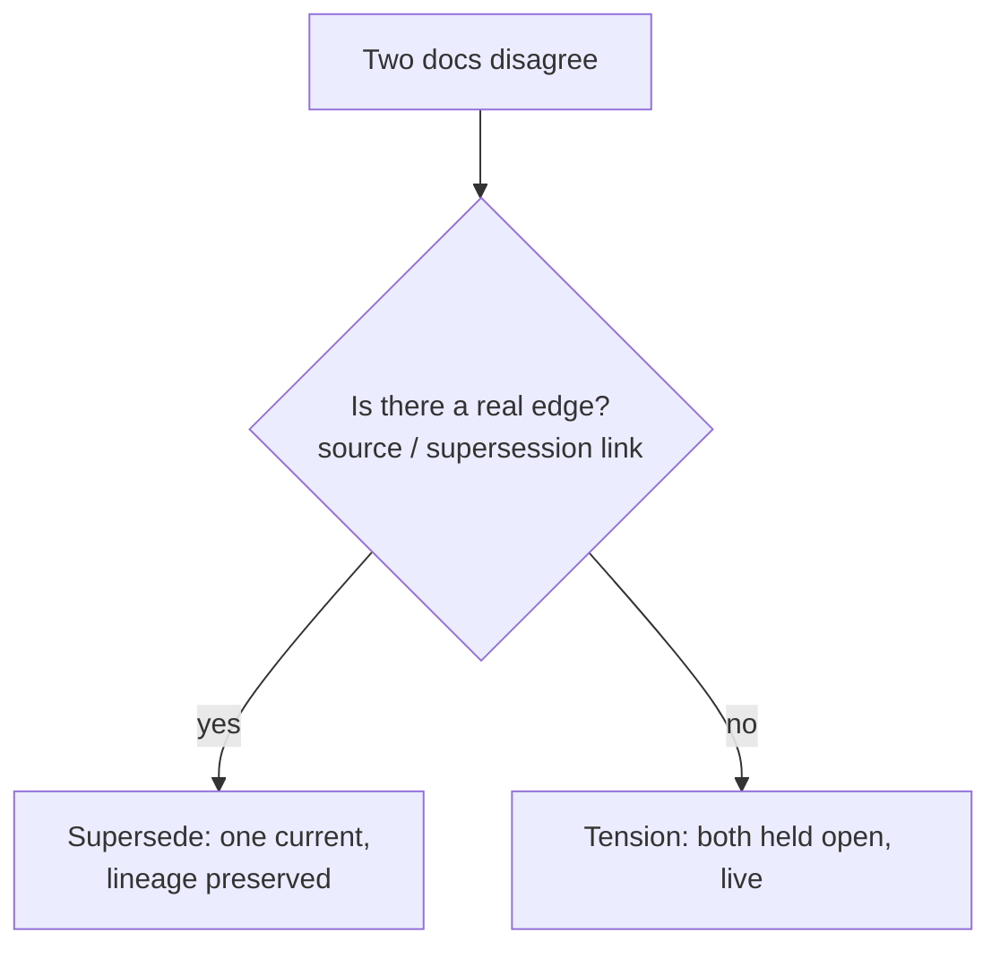

# Daftari

[](https://github.com/mavaali/daftari/actions/workflows/ci.yml) [](https://www.npmjs.com/package/daftari) [](LICENSE)

*Daftari* (دفتری) is the Urdu word for a ledger-keeper: the person in a
trading house who maintained the *daftar*, the bound register where every
transaction was recorded, cross-referenced, and preserved. The daftar was not a
filing cabinet. It was a living document. Entries referenced earlier entries.
Corrections were noted, not erased. The ledger got more valuable the longer it
was kept, because the accumulated record revealed patterns no single entry
could.

Daftari is the **long-term memory cortex for your LLM agents** — a persistent,
structured vault they read, write, and curate over time, **portable across any
model.** A cortex, not a clipboard.

## Rent the brain, own the memory

LLMs are stateless; they forget. So memory is being bolted on everywhere — but
*inside the model*: ChatGPT memory, Claude projects, Copilot, Gemini. Memory is
becoming a feature of the provider, and whoever holds your memory holds you.

Daftari takes the other path. The model is the rented part — swappable, obsolete
in six months. Your memory is the durable asset, so it should belong to you and
travel with you: plain markdown on your disk, under git, readable in any editor,
queryable by any agent. **Compilation over retrieval** — the agent compiles an
answer once and writes it back, so every later read starts from the compiled
result instead of re-stitching chunks from zero.

## Not a second brain

Second brains are memory for a *human* to think with — you catch the stale fact,
you notice the contradiction. Daftari is memory for an *agent* to reason with:
the persistence layer for a consumer that acts on what it is handed and cannot
sanity-check it first. Same substrate (markdown, links); reversed purpose — and
a higher bar, because the reliability has to live in the memory, not the reader.

## It remembers — it doesn't resolve for you

Because the agent can't infer them, the vault carries three things and collapses
none:

- **what's current** — supersession follows a real edge to the latest source
- **what's grounded** — provenance on every entry; the vault never mints a value
- **what's contested** — contradictions surface as *tensions*, held open, not
  flattened into a false answer

The daftar noted corrections rather than erasing them. Daftari keeps that as a
law:

> **A tension may never masquerade as a supersession.**

It resolves only by discovery — a real edge — never by invention. The agent
compiles; the vault preserves; *you* keep the judgment. See
[the manifesto](docs/manifesto.md) for the full argument.



## What it is

A directory of markdown files with YAML frontmatter, exposed to agents as 27
MCP tools over stdio. The vault is plain text: you can read it in any editor,
`git log` it, grep it. Daftari adds the machinery agents need to treat it as a
shared workspace.

```
npx daftari --init ./my-vault
npx daftari --vault ./my-vault --user me --role admin
```

Point any MCP client (Claude Desktop, Claude Code, an agent SDK) at it.

## The four layers

All four implement one idea — *resolve only by discovery, never by invention.*
Read [**The core idea**](docs/architecture.md#the-core-idea) first and the layers
become its consequences. Storage and access control are table stakes; the moat is
layers 3 and 4.

|Layer                |What it does                                                                                          |Why it matters                                                         |
|---------------------|------------------------------------------------------------------------------------------------------|-----------------------------------------------------------------------|
|**Storage**          |Markdown + frontmatter on disk, git history, rebuildable SQLite index for hybrid BM25 + vector search.|Plain text is the source of truth. Delete every `.db` file and rebuild.|
|**Access control**   |Config-driven RBAC. Roles and per-collection read/write/promote permissions in `.daftari/config.yaml`.|Multiple agents, scoped access, no user-management system.             |
|**Write arbitration**|File-level locks (60s TTL), auto-commit to git, structured provenance log.                            |Concurrent agents write safely. Every mutation is attributable.        |
|**Curation**         |Draft-to-canonical lifecycle, TTL-based staleness, tension logging, advisory linter.                  |Knowledge that stops being true gets surfaced, not silently trusted.   |

## The tools

**Read:** `vault_read`, `vault_index`, `vault_status`

**Attest:** `vault_receipt` — compile an epistemic receipt for the documents
an answer cites: per-source status, confidence, provenance, freshness, exact
content-version hash, supersession-chain resolution, and open tensions, plus
deterministic summary flags, the vault's git HEAD as an as-of anchor, and a
recomputable hash over the whole receipt. Attach it to the answer so any
consumer can see what the answer stands on.

**Believe:** `vault_canon` — compute settled vs. contested belief across
holders over an emergent topic (params: `seed`, `holders?`, `as_of?`,
`depth?`). Returns a per-claim settled/contested classification, integrity
flags (`graph_completeness: "curated"`, `partial_visibility`, `unindexed`,
`ghost_holder_warning`), and an attached `vault_receipt` as the epistemic
anchor. Recorded, not omniscient: settled means no contradiction is on record,
not that none exists. Never auto-resolves.

**Witness:** `vault_witness` — per-principal track records from the vault's
own ledgers, priced by the wager schedule: write volume, live claims with
open exposure, contested claims with stake at risk, the settled book
(burned vs credited), proposal outcomes, tensions logged. Advisory and
deterministic; includes the flat-curve monitor so a single-author vault is
reported as uninformative rather than as signal.

<details>
<summary><b>The full per-category tool registry and the tool-tier config (▸ expand for full reference)</b></summary>

**Search:** `vault_search` (hybrid BM25 + vector; hits carry their unresolved
tensions inline and foreground the current source of superseded documents),
`vault_search_related`, `vault_themes` (thematic clustering), `vault_reindex`

**Write:** `vault_write`, `vault_append`, `vault_promote`, `vault_deprecate`, `vault_supersede`, `vault_merge`, `vault_set_confidence`

**Curate:** `vault_tension_log`, `vault_tension_resolve`, `vault_tension_clusters`, `vault_tension_blast`, `vault_lint`, `vault_provenance`

**Edges:** `vault_edge_observe`, `vault_edge_contest`, `vault_edges`

**Ratify:** `vault_stage_action`, `vault_ratify`

The curation engine is advisory: `vault_lint` reports problems and
`vault_tension_log` records contradictions. Neither auto-fixes anything. Every
change is a deliberate, attributable act.

### Tool tiers

Every advertised tool costs the agent context tokens and a decision branch.
The `tools` block in `.daftari/config.yaml` picks how much of the registry
`tools/list` advertises:

```yaml
tools:
  tier: standard   # core | standard | full (default: full)
  include:         # add tools the tier omits
    - vault_tension_log
  exclude:         # remove tools the tier includes — exclude wins
    - vault_status
```

`core` is the search-before-derive loop (`vault_search`, `vault_read`,
`vault_write`, `vault_index`, `vault_lint`, `vault_status`); `standard` adds
the full document lifecycle (append/promote/deprecate/supersede/merge,
confidence and tier setters, propose/ratify) plus diagnostics; `full` is
everything. `--tools <tier>` overrides the tier for one invocation. Filtering
only changes what is *advertised* — calls to any registered tool still work,
so an agent holding a cached tool name keeps working across a tier change.
Unknown names in `include`/`exclude` warn at startup and are ignored, so a
config written for a newer daftari still loads.

</details>

**Evaluate (opt-in, requires an Anthropic API key):** `daftari eval` — scores how
well an LLM can use the curation surface to answer multi-hop questions about the
vault. See the [design spec](docs/superpowers/specs/2026-05-31-cortex-quality-metric-design.md)
for the rationale and the cortex framing.

## Two kinds of knowledge

Every document declares a `domain`. The distinction drives how the curation
layer treats it.

**Accumulation** documents compile and compound. A competitive-intel note, a
pricing breakdown, a researched comparison. Each write builds on the last.
Going stale is a problem to fix.

**Generative** documents speculate. A moonshot sketch, a brainstorm, a “what
if.” Going stale is expected, not a defect.

Applied uniformly, the same curation rules would either nag about every
brainstorm or wave through every stale fact. The domain split lets the system
hold each to the right standard.

## Access control

No user-management system. Roles live in config, the server starts with one.
No `--role` or an unknown name falls back to deny-all. An agent identity is
just a role too — e.g. a `curation-loop` role that reads and writes but leaves
`ratify` off: the agent proposes, humans ratify.

<details>
<summary><b>Roles config example (▸ expand for full reference)</b></summary>

```yaml
roles:
  analyst:
    read: [competitive-intel, pricing]
    write: [competitive-intel, _drafts]
  researcher:
    read: ["*"]
    write: [moonshot, _drafts]
  admin:
    read: ["*"]
    write: ["*"]
    promote: true
    ratify: true   # may approve/reject staged actions and contest edges
```

</details>

## File format

Markdown with YAML frontmatter. Frontmatter is the metadata layer; there is no
separate database.

```yaml
---
title: "Aurora Pipelines — Positioning Overview"
domain: accumulation
collection: competitive-intel
status: canonical
confidence: medium
created: 2026-05-17
updated: 2026-05-17
updated_by: agent:claude-code
provenance: synthesized
sources:
  - aurora-product-page
ttl_days: 120
valid_from: 2026-05-01
valid_until: null
tags: [aurora, ingestion, competitive]
questions_answered:
  - "How does Aurora frame the ingestion/transformation boundary?"
questions_raised:
  - "Does an authored-pipeline model slow teams down at small scale?"
---
```

Documents can make their epistemic edges explicit: `questions_answered` is what
later agents can take as settled, `questions_raised` is where to build next.
`vault_lint` turns the open questions across the vault into a coverage map.

`valid_from` / `valid_until` are the second temporal axis. Everything else in
the file records **transaction time** — when the vault came to believe
something; these record **valid time** — when the claim was true in the world. A
document edited this morning can describe a price that stopped applying in
March, and only the second axis can tell you so. That makes supersession
checkable rather than merely asserted:

```bash
daftari asof 2026-04-01 --valid 2026-01-15
```

"On April 1st, what did the vault believe was true on January 15th?"

<details>
<summary><b>Half-open valid-time intervals and the authoring rules (▸ expand for full reference)</b></summary>

The window is half-open — `[valid_from, valid_until)` — so `valid_until` is the
first day the claim no longer held, and a successor's `valid_from` is exactly
its predecessor's `valid_until`. Handoffs share no day and leave no gap. The
fields are optional and always authored: nothing derives them from git dates or
mtime, because that would manufacture a claim nobody made. Both null means
unknown, which is never read as "always true".

Full field reference in <docs/file-format.md>.

</details>

## Adopting an existing vault

Already have a wiki or an Obsidian vault? Daftari adopts it **in place** — it
indexes and curates the same markdown files you already edit, not a separate copy.

```bash
# Dry run — see what would change, write nothing
daftari import obsidian ~/my-vault --plan

# Adopt one folder at a time (per-folder ratification; --yes to skip the prompt)
daftari import obsidian ~/my-vault --apply --scope notes
```

The import is non-destructive to your content. It fills only the *missing*
Daftari frontmatter — collection from the folder, dates from git history (or file
mtime), sensible defaults for the rest — and preserves everything you already
had, including custom frontmatter fields. Obsidian specifics: inline `#tags` are
merged into `tags`, a Web Clipper `source` is mapped into `sources`, and
`[[wikilinks]]` are left untouched (Daftari resolves them as written). Filling
frontmatter is deliberate, not automatic — re-run the import to pick up newly
added notes.

### Cloud-synced vaults (iCloud, Dropbox, …)

Daftari versions every change with git, and a `.git/` directory churning inside a
cloud-synced folder can corrupt. For a synced vault, keep git's data outside it:

```bash
daftari import obsidian "~/Library/Mobile Documents/.../my-vault" \
  --apply --scope notes --external-git-dir
```

This writes `git_dir: external` to `.daftari/config.yaml`, so Daftari uses
`git init --separate-git-dir`: only a tiny static `.git` *file* stays in the vault
(syncs harmlessly) while the repo data lives under `~/.local/share/daftari/git/`.
Pass `--external-git-dir=/path` for an explicit location, or set `git_dir`
directly in config to apply the same to any vault. History is per-device; your
notes still sync everywhere.

### Lower-level: `backfill`

`daftari import obsidian` is a thin, Obsidian-aware wrapper over `daftari
backfill` — the git-driven frontmatter migration that works on any markdown wiki.
Use it directly for non-Obsidian trees:

```bash
daftari backfill --plan
daftari backfill --apply --scope specs
```

## Open Knowledge Format (OKF)

[OKF](https://cloud.google.com/blog/products/data-analytics/how-the-open-knowledge-format-can-improve-data-sharing/)
is Google Cloud's vendor-neutral spec for the LLM-wiki pattern: a directory of
markdown files with YAML frontmatter that any producer can emit and any consumer
can read without translation. A Daftari vault *is* that pattern, so `daftari
okf` bridges the two directions.
[v0.2](https://cloud.google.com/blog/products/data-analytics/okf-v0-2-adds-trust-signals/)
adds opt-in **trust signals** — raw credibility indicators (provenance,
verification, lifecycle, freshness), never computed scores — and Daftari maps
them from/to its native metadata.

<details>
<summary><b>OKF export / import field-mapping and the <code>daftari okf</code> commands (▸ expand for full reference)</b></summary>

**Export** renders the vault as a portable OKF bundle — every doc becomes an OKF
concept doc (the core `type` / `title` / `description` / `resource` / `tags`
fields, plus a verbatim `daftari` sidecar for lossless round-trip), with
generated `index.md` (progressive-disclosure listing) and `log.md`
(chronological history). Trust signals derive from native metadata:
`updated`/`updated_by` become `generated`, the lifecycle maps to
`draft`/`stable`/`deprecated`, `ttl_days` becomes an absolute `stale_after`
date, and `sources` become structured entries. `verified` is never fabricated —
Daftari records authorship, not independent confirmations, so exported docs
honestly read as unverified. The source vault is never mutated.

```bash
daftari okf export ./my-vault --out ./okf-bundle
daftari okf export ./my-vault --out ./okf-bundle --collection pricing
```

**Import** adopts an OKF bundle into a vault. A bundle produced by `okf export`
round-trips exactly via its sidecar; a foreign bundle is mapped conservatively
(docs land as `draft` in the `accumulation` domain, the original OKF `type` is
preserved in an `okf_type` field). Trust signals inform the mapping: a
human-reviewed doc (a `human:*` entry in `verified`) imports with `confidence:
high`, `status: deprecated` stays `deprecated` (retired knowledge must not
resurface as a fresh draft), and `stale_after` converts to `ttl_days`. An
`Attested Computation` is surfaced in an import warning but **not**
auto-write-protected: `tier: source` is enforcement, and its only sanctioned
grant path is `vault_set_tier` (reason required, provenance-logged) — a foreign
bundle's self-declared `type` doesn't buy it. Review the doc, then elevate
deliberately. OKF fields with no lossless Daftari slot (the trust record,
attestation machinery) are preserved under `okf_*` keys. Writes auto-commit and
the index is rebuilt.

```bash
daftari okf import ./okf-bundle --into ./my-vault --dry-run
daftari okf import ./okf-bundle --into ./my-vault
```

</details>

## Server mode (self-hosted)

By default daftari is a per-user stdio process. `daftari serve` starts the
same vault as **one always-on instance over Streamable HTTP** — for a team, or
for clients that can't spawn a local process (claude.ai web/mobile, Cowork):

```bash
daftari serve --vault ./my-vault              # http://127.0.0.1:8787/mcp
daftari serve --vault ./my-vault --bind 0.0.0.0 --port 9000
```

Identity is **per MCP session**, resolved when the session opens, so every
RBAC and existence-disclosure rule applies per connection with zero tool
changes. Two composable auth schemes, both declared in config.

<details>
<summary><b>Auth config (bearer tokens + OAuth 2.1) and the fail-loud posture (▸ expand for full reference)</b></summary>

```yaml
server:
  transport_security: external   # required off-loopback: TLS terminates upstream
  auth:
    tokens:                      # static bearer tokens (agents, ETL)
      - env: DAFTARI_TOKEN_ETL   # the VALUE lives in this env var, never in config
        user: agent:etl
        role: admin
    oauth:                       # OAuth 2.1 resource server (humans via your IdP)
      issuer: https://idp.example.com
      audience: daftari
      jwks_uri: https://idp.example.com/.well-known/jwks.json
      subjects:
        "alice@example.com": { user: human:alice, role: analyst }
```

The posture is fail-loud, never silent-downgrade: a non-loopback bind refuses
to start without auth **and** the explicit `transport_security: external`
acknowledgment (daftari never terminates TLS itself — put Caddy/nginx/a load
balancer in front); with any auth configured, a bad or missing credential is
a 401 at session open and a valid JWT whose subject isn't mapped is a 403 —
neither ever becomes the guest. Guest sessions exist only in the no-auth
loopback configuration. A running server also refuses to be silently killed:
stray stdio invocations against the same vault refuse to start, and replacing
a live holder requires a deliberate `daftari serve --takeover`.

</details>

## Storage backing

A self-hosted vault can push to durable object storage (#6). The local git
working copy stays canonical — reads, writes, auto-commits, locks, and the
index all stay exactly as above — and the backing is a dumb sync target.

<details>
<summary><b>Storage config, <code>daftari sync</code> commands, and sync semantics (▸ expand for full reference)</b></summary>

```yaml
# .daftari/config.yaml
storage:
  backend: s3            # fs | s3 | azure
  bucket: team-vault
  region: us-east-1
  # endpoint: https://…  # MinIO / R2 / GCS S3-interop endpoints
  # sync_interval_minutes: 15   # daftari serve pushes on this cadence
```

```bash
daftari sync --vault ./my-vault              # incremental push
daftari sync --vault ./my-vault --dry-run    # show the diff only
daftari sync --vault ./empty-dir --restore --backend s3 --bucket team-vault
```

The push covers the markdown tree, the `.git` directory, and durable
`.daftari` journals; the rebuildable SQLite index and lock files never sync.
Neither do `.git/config` and `.git/hooks` — git *executes* what those
declare, and a backup channel must not deliver code (`git clone` refuses to
transmit them for the same reason), so re-add remotes and local git config
by hand after a restore.
Cloud backends load their SDKs (`@aws-sdk/client-s3`, `@azure/storage-blob`)
as optional dependencies — install the one you use; credentials come from the
SDK's standard environment chain, never from vault config. GCS is reached via
its S3-interoperability endpoint. Restore refuses non-empty directories and
reindexes when done.

</details>

## How it compares

The real question a memory layer has to answer: **what happens when two facts
contradict?**

| What happens to a contradiction? | Systems |
|---|---|
| Invisible | AGENTS.md, RAG |
| Synthesis-overwrite (association only) | Mem0 (OSS), ChatGPT / Claude memory, Glean |
| New wins, old tagged-invalid | Zep / Graphiti, Sentra |
| Resolved by graph / majority-vote | Cognee, ElephantBroker |
| **Held open, live & queryable** | **Daftari** |

And the honest cost, since compounding isn't free:

| Who has to do the curation work? | |
|---|---|
| RAG | Nobody — retrieval only, zero authoring cost |
| AGENTS.md | One file, hand-maintained |
| **Daftari** | **An agent (or human) curates — the heaviest of the three, and the reason knowledge compounds** |

> The nearest formal prior art is **TOKI** ([arXiv 2606.06240](https://arxiv.org/abs/2606.06240),
> with a [reference implementation](https://github.com/ZenAlexa/toki-bitemporal-memory)):
> a bitemporal operator algebra whose opt-in `await-confirmation` operator can hold a
> contradiction open. The line: TOKI resolves at write time (hold-open is one of four
> operators) and keeps the loser in an *archival* audit row; Daftari makes non-resolution
> the *default* and keeps both facts *live and queryable* in retrieval.

## What’s not in v1

Deliberately deferred to keep the surface tight:

- **Cloud-hosted multi-tenant SaaS** (self-hosted server mode HAS shipped —
  see [Server mode](#server-mode-self-hosted) and
  [Storage backing](#storage-backing); the project itself hosts nothing)
- **Conflict resolution beyond file-level locks** (CRDTs, semantic merge)
- **Background curation agent** running lint on a cadence
- **Enforced domain separation** (v1 documents the convention; v2 enforces it —
  advisory boundary warnings shipped in the meantime: `vault_lint`'s
  `domainLeaks` check and write-time `domain_warnings`)

(LLM reranking, deferred here originally, has since shipped as the opt-in
agent-as-judge `rerank_candidates` on `vault_search`: the server prepares the
fused candidate pool and the protocol; the calling agent is the judge.)

Each is a clean increment on a surface that already works.

## Coherence audit

`daftari audit` is a read-only, deterministic check across one or more
markdown repos for **broken cross-repo references** and **link-graph
transitive staleness**. It works against any markdown tree — daftari-managed
or not. The audit creates no `.daftari/` directory and writes nothing to the
audited repos.

### Multi-repo (the headline use case)

When two or more repos link to each other, the audit detects broken
references that neither repo's own lint could see — because each repo only
knows about itself.

```bash
daftari audit \
  --repo ~/repos/service-a \
  --repo ~/repos/service-b
```

That works for relative-path links (`../service-b/docs/api.md`). For
GitHub-style URL links between repos (`https://github.com/org/service-b/...`),
declare each repo's URL patterns in an `audit.yaml` so the resolver can map
them back to the local repo:

```yaml
# audit.yaml
repos:
  - name: service-a
    path: ~/repos/service-a
    urls: ["github.com/org/service-a"]
  - name: service-b
    path: ~/repos/service-b
    urls: ["github.com/org/service-b"]
```

```bash
daftari audit --config audit.yaml
```

### Single repo

The same command, one `--repo`:

```bash
daftari audit --repo ./docs
```

In single-repo mode the cross-repo check trivially has no work, but the
staleness check still runs over the in-repo link graph.

### What gets detected

- **Missing files.** A link from `service-a/intro.md` to `../service-b/api.md`
  or `https://github.com/org/service-b/blob/main/api.md` — flagged if `api.md`
  doesn't exist in `service-b`.
- **Missing anchors.** Same link with `#run` — flagged if `api.md` has no
  `## Run` heading.
- **Direct staleness.** Any doc whose git mtime is older than
  `staleness.threshold_days` (default 540, ~18 months).
- **Transitive staleness.** A fresh doc that links — directly or through a
  chain — to a stale doc is itself flagged, with the shortest chain reported.
  Catches the case where you keep touching an index page while the docs it
  links to are rotting.

<details>
<summary><b>Sample output, CI integration, exit codes, CLI flags, and the full <code>audit.yaml</code> schema (▸ expand for full reference)</b></summary>

### Sample output

```markdown
# Coherence Audit Report

## Totals
- repos scanned: **2**
- docs scanned: **47**
- broken cross-repo refs: **2**
- directly stale docs: **3**
- transitively stale docs: **5**

## Broken cross-repo references
| kind           | source                    | target                  | href |
|----------------|---------------------------|-------------------------|------|
| missing_anchor | service-a/intro.md        | service-b/api.md#run    | `https://github.com/org/service-b/blob/main/api.md#run` |
| missing_file   | service-a/architecture.md | service-b/deleted.md    | `../service-b/deleted.md` |

## Staleness
| kind       | doc                      | mtime      | chain |
|------------|--------------------------|------------|-------|
| transitive | service-a/onboarding.md  | 2026-04-01 | service-a/onboarding.md → service-b/legacy-flow.md |
```

JSON output (`--output-json` or `output.json` in config) carries the same
structure with full detail in `brokenRefs[]` and `staleness[]` arrays plus a
`totals` summary block for compact downstream rendering.

### CI integration

The audit's exit code is designed to gate CI:

```yaml
# .github/workflows/docs-audit.yml
name: Docs audit
on: [pull_request]
jobs:
  audit:
    runs-on: ubuntu-latest
    steps:
      - uses: actions/checkout@v4
        with: { fetch-depth: 0 }   # full history so git mtime works
      - run: npx daftari@latest audit --config audit.yaml
```

Exit codes:

| code | meaning |
|------|---------|
| `0`  | clean run, all findings within `fail_on` thresholds |
| `1`  | clean run but a threshold was exceeded — CI fails |
| `2`  | config error (missing required fields, bad paths, malformed YAML) |
| `3`  | runtime error (IO failure during collection) |

### CLI flags

`audit.yaml` and CLI flags overlap; CLI wins. A warning is printed to stderr
when `--output` or `--output-json` displaces a value from the config.

- `--repo <path>` — add a repo. May be repeated. Anonymous CLI repos get no
  URL patterns; URL-based cross-refs into them won't be detected. Use
  `--config` for URL-aware repos.
- `--config <path>` — load an `audit.yaml`.
- `--output <md>` — markdown report destination (default: stdout).
- `--output-json <json>` — JSON report destination (default: not written).
- `--help` — full help text.

### Full `audit.yaml` schema

```yaml
repos:
  - name: service-a
    path: ~/repos/service-a
    docs_glob: "docs/**/*.md"       # default: "**/*.md"
    urls:                            # optional; enables URL-pattern matching
      - "github.com/org/service-a"

  - name: service-b
    path: ~/repos/service-b
    urls:
      - "github.com/org/service-b"

output:
  markdown: coherence-report.md      # default: stdout
  json: coherence-report.json        # default: not emitted

staleness:
  threshold_days: 540                # default: 540 (18 months)

fail_on:
  broken_refs: 1                     # default: fail on any broken ref
  transitive_staleness: 100          # default: generous; teams tune
```

</details>

## The vault as witness — and the wager layer

Every write already carries an identity, every proposal an outcome, every
tension a logger and a ruling. `vault_witness` aggregates that ledger into a
**track record per principal** — and prices it. Confidence is free to claim,
so the wager schedule makes it cost something: writing at `high` stakes 3
points, `medium` 1, `low` 0 (hedged claims are the honest default and are
never taxed). A claim later corrected by a ruling or retired by someone else
burns the stake; a claim maintained through a full TTL cycle earns credit.
The balance is arithmetic on recorded facts — advisory, provisional
constants, nothing enforced: routing a high-stakes write to the agent with
the earned balance is your policy, not the vault's.

<details>
<summary><b>The two kill conditions that travel with the tool (▸ expand for full reference)</b></summary>

Both kill conditions from the design travel with the tool: the flat-curve
monitor (one author ≥95% of writes → curves declared uninformative) and the
longitudinal write-volume series (if stake-fear suppresses honest claims, it
shows up here first).

</details>

## Circadian memory

The vault sleeps. `daftari sleep` is the nightly metabolic pass — deterministic,
LLM-free, write-free (documents are never touched):

```bash
# In cron (any scheduler works; daftari ships the cycle, not a daemon):
0 3 * * * cd /path/to/vault && npx daftari sleep --output .daftari/morning-report.md
```

The cycle sweeps expired staged actions, scores every document's decay, and
builds the **wake list**: canonical accumulation documents past their TTL
with downstream dependents, ranked by blast radius. The list is written to
`.daftari/wake-queue.jsonl` for an external agent to consume — re-verify each
document against its sources, stage the diff — because the vault never
re-verifies on its own. Generative documents going stale are expected, not a
defect: counted, never woken.

The **Morning Report** ends where the human begins: tension aging and the
court docket head, the ratification queue with soon-to-expire proposals, and
the rubber-stamp monitor — zero rejections over a long decision history is
printed as a warning, not a compliment. The agent proposes overnight; you
ratify over coffee.

## Tension Court

Tensions wait in a log; the court turns them into decidable cases. `daftari
court` compiles a **docket** — every open tension briefed and ranked (stale
first, then by blast radius): both sides' claims, the present state of their
documents, the downstream stakes, cluster membership, and **precedents** —
past rulings on disputes that shared a document, a collection pair, or a
kind.

```bash
# The docket — a 5-minute weekly ritual
daftari court --vault ./my-vault

# One case's full brief (verbatim rationales from cited precedents)
daftari court --tension tension-abc123

# Rule. The rationale is recorded verbatim and cited by future dockets.
daftari court rule tension-abc123 --kind corrected \
  --rationale "Vendor pricing page confirmed the entry tier on 2026-07-10."
```

Rulings go through the same `resolveTension` write path as
`vault_tension_resolve` — a ruling records the closure, it never edits the
disputed documents. Precedent retrieval is deterministic (shared-document >
collection-pair > same-kind; no LLM): the court retrieves how this house has
resolved similar disputes before, and whether a precedent applies stays the
human's judgment. Memory grows case law.

## The principal interview

The vault interrogates you. `daftari interview` assembles a question sheet
from what the vault already knows is unclear — open tensions (contested
first, longest-carried first), canonical accumulation docs past their TTL,
and `questions_raised` entries no document answers — deterministic and
LLM-free, like the circadian pass:

```bash
# The sheet — read-only, priority-ordered
daftari interview --vault ./my-vault

# Sit for it. Answers are recorded VERBATIM; empty skips, 'q' ends.
daftari interview ask --vault ./my-vault
```

Answered questions become a transcript document in an `interviews/`
collection — `tier: source` (your words, body immutable), `provenance:
direct`, no TTL (testimony doesn't expire) — committed like any other write,
with `sources` tracing each question back to the tension or document that
prompted it. The pattern is the companion interview on a living-summary
page: the compiler's highest-value move is not more compilation, it is
asking the principal about the unclear spots and folding the verbatim
answers back into the corpus.

Recording testimony resolves nothing. The transcript is *evidence*: the CLI
ends by pointing at `daftari court rule <id> --references <transcript>` for
tensions it touched, and at re-verified writes for stale docs. Operator-only,
like the court — no MCP tool, no access context.

## Belief archaeology

Git is the version layer, so the vault can answer **"what did we believe on
March 3?"** `daftari asof` is a read-only report over the repo's history — no
checkout, no index, no API key:

```bash
# The vault's belief state at a date (or any git ref), plus the drift since
daftari asof 2026-03-03 --vault ./my-vault

# One document's trajectory: frontmatter then vs now, commits in between
daftari asof HEAD~20 --doc pricing/helios-consumption-pricing.md

# Counterfactual replay: this fact turned out wrong — who had inherited it
# at the time, and where are they now?
daftari asof 2026-03-03 --blast pricing/helios-consumption-pricing.md
```

The default report shows the document and tension state at that point and
the drift since: documents added/removed, `status`/`confidence` transitions,
and tensions opened or resolved. `--blast` computes the blast radius of a
document over the tree *as of the commit* (same source/link edge semantics as
`vault_tension_blast`), annotating each downstream document with its status
today — the post-mortem view for a fact that was later corrected. Markdown to
stdout by default; `--output` / `--output-json` write files. Pairs with
`vault_receipt`: a receipt's `vaultHead` is exactly the anchor to hand back
to `asof`.

## Development

```
npm install
npm run build
npm test
```

Design tenets: functions and types, no classes; tool handlers return
`Result<T, Error>` rather than throwing; tests mirror the `src/` structure.

## Documentation

- <docs/getting-started.md> — scaffold, write, search, lint, promote, deprecate
- <docs/architecture.md> — layered design, request path, accumulation vs. generative domains
- <docs/file-format.md> — complete frontmatter reference

## Integrations

- [`integrations/langchain/`](integrations/langchain/) — `langchain-daftari`, a
  Python package that exposes the 14 daftari tools as LangChain `BaseTool`s
  for use with LangGraph / `create_react_agent`. Sync + async, schemas pulled
  live from `tools/list`.
- [`packages/router`](packages/router) — multi-vault MCP router that fans out across N Daftari vaults

## Privacy

Daftari is a local MCP server. It runs on your machine, against vault files on
your machine. The default configuration makes no network calls — vault content
stays on your local filesystem and is read or written only through tools the
MCP client invokes. The only optional egress is the OpenAI embedding provider,
which the user must explicitly opt into per vault.

Full policy: [PRIVACY.md](./PRIVACY.md) — covers data collection (none),
storage (local-only), the OpenAI opt-in, third-party integrations (none),
retention, and contact.

## License

MIT.
