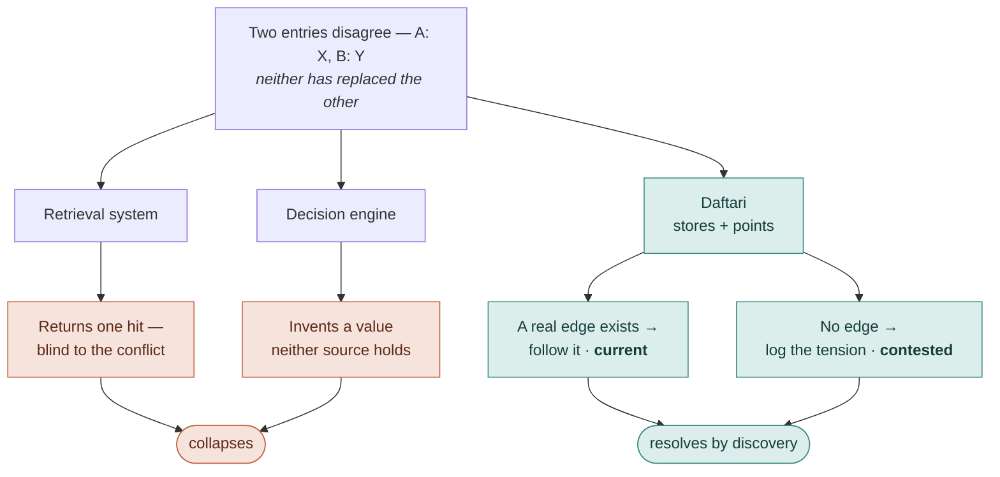

# Architecture

A knowledge vault has an easy job and a hard job. The easy job is holding what
you give it. The hard job is still being trustworthy a year later — after a
dozen agents have written to it, after half its facts have quietly gone out of
date, after two notes have started to contradict each other and nobody noticed.

Most of this document is about the hard job. The easy job fits in a paragraph:
Daftari is a single MCP server, started against one vault directory, running as
one access identity for its lifetime, serving 25 tools over stdio. Five more
surfaces are CLI-only — `daftari backfill`, `daftari import obsidian`,
`daftari audit`, `daftari eval`, and `daftari consolidate` — plus a one-shot
`daftari --init` scaffolder; each is introduced below where it earns its place
(see [Adoption](#adoption), [The consolidation loop](#the-consolidation-loop),
and [Doc-to-code coherence](#doc-to-code-coherence)).

That's it for the easy job. The rest is the four layers a single tool call falls
through, and — the part worth your attention — *why each layer refuses to do
slightly more than it does.* The restraint is the design.

## The core idea

Before the layers, the one idea they all serve. Daftari is memory for an agent
that *acts on what it is handed and cannot sanity-check it first* — so every
judgment a human reader would supply for free has to move into the memory itself.
There are three such judgments, and the design collapses none of them into a
convenient answer:

- **What's current.** When a fact changes, point to the latest source by
  *following a real edge* — a supersession — never by guessing.
- **What's grounded.** Every entry traces to where it came from. The memory
  never mints a value of its own; it stores and points, it does not invent.
- **What's contested.** When two facts genuinely disagree and neither has
  replaced the other, that disagreement is a first-class object — a *tension* —
  held open, not flattened into a false resolution.

Everywhere else the reflex is to collapse. A retrieval system returns one hit,
blind to the conflict; a decision engine resolves the conflict into a generated
answer. Both hand the agent a clean story that isn't true. Daftari's move is the
opposite, and it is the same move at every layer: *compute the signal — staleness,
decay, derivation — then, at the moment of action, throw the minted value away and
author only the relation.* A `superseded_by` edge. A logged tension. Never an
invented value.



One line holds the whole system together, and the reason to like it is that it is
*falsifiable* — you can point at any record and check whether it faked a
resolution:

> **A tension may never masquerade as a supersession.**

The argument for *why* — memory you own for a model you rent, and the centuries-old
ledger discipline behind it — lives in the [manifesto](manifesto.md). The rest of
*this* document is how the four layers make that one law structural.

## The layered model

```
                      ┌─────────────────────────────┐
   MCP client  ──────▶ │  MCP server (stdio, 25 tools)│
   (agent)             └──────────────┬──────────────┘
                                      │  every call
                       ┌──────────────▼──────────────┐
              Layer 2  │  ACL — config-driven RBAC    │  can this role read/
                       │  (.daftari/config.yaml)      │  write/promote here?
                       └──────────────┬──────────────┘
                                      │  permitted
                       ┌──────────────▼──────────────┐
              Layer 3  │  Write safety                │  file lock (60s TTL),
                       │  locks · git · provenance    │  auto-commit, log
                       └──────────────┬──────────────┘
                                      │  mutation applied
                       ┌──────────────▼──────────────┐
              Layer 4  │  Curation                    │  staleness · tensions
                       │  lint · tension · lifecycle  │  · lint · promote/dep.
                       └──────────────┬──────────────┘
                                      │
                       ┌──────────────▼──────────────┐
              Layer 1  │  Storage                     │  markdown + frontmatter
                       │  markdown · git · SQLite idx │  · git history · index
                       └─────────────────────────────┘
```

Read the layers as concerns, not as a call stack. Nothing marches top to bottom
every time: a read touches only layers 2 and 1; a write travels through 2, 3, 4,
and 1. The numbering follows the README's four-layer model. The sections below
walk them foundation-first — Storage, then the access, safety, and curation
concerns stacked on top — which is not the order a call visits them, so read for
*what each layer is responsible for*, not for a sequence.

### Layer 1 — Storage

Start at the bottom, because the bottom is the whole bet. The vault is a
directory of markdown files, each with a YAML frontmatter block — and that is
the entire source of truth. Frontmatter *is* the metadata layer; there is no
separate metadata store, no document database, no second copy of anything that
matters. If that sounds austere, it buys a property worth the austerity:
**delete every `.db` file and the vault loses nothing.** Everything else in this
layer — git, the search index, the lock store — is either history or a cache you
can rebuild from the markdown at any time.

This is also the deepest layer in the document, because the index, the embedding
cache, clustering, and one-time adoption all live here. If you're reading for the
shape of the system, the three things just below are the spine — the rest of
Layer 1 is reference depth, and the `####` subsections (thematic clustering,
reactive indexing, adoption) are safe to skip on a first pass and return to when
you need them.

Three things sit alongside the markdown:

- **Git.** The vault root is a git work tree. Every write auto-commits, so the
  files' git history *is* the document history. There is no second versioning
  system. A vault nested in a larger repo can set `auto_commit: false` in
  `.daftari/config.yaml` to opt out: writes still produce durable, indexed,
  provenance-logged files, but staging and committing are left to the caller.
- **SQLite index** (`.daftari/index.db`). Holds the lexical (FTS5) and
  vector (sqlite-vec) indexes that power hybrid search. It is **ephemeral**
  — it can be rebuilt from the markdown files at any time with
  `vault_reindex`, and it is git-ignored.

  Lexical ranking lives in two FTS5 virtual tables — `chunks_fts` over
  chunk text and `documents_fts` over title, tags, and body — kept in
  sync by AFTER INSERT / UPDATE / DELETE triggers on the underlying
  `chunks` / `documents` tables.

  The default lexical granularity is **chunk** (since v1.29.0). The BM25
  score over `chunks_fts` is rolled up to each document's *best* chunk, then
  *tiered* with a column-restricted title/tag pass over `documents_fts`:

  $$\text{score}_{\text{lex}}(d) = \max_{c \,\in\, d}\text{BM25}(c)\ \in\ (0.5,\,1] \ \text{ for a body match}; \qquad (0,\,0.5] \ \text{ for a title/tag-only match}$$

  The bands are disjoint by construction, so *every* body match outranks
  *every* title-only match regardless of the raw BM25 magnitudes — which is
  why a de-weighted single score (a `0.99` max) couldn't hold the ordering
  but two non-overlapping intervals can. The two halves earn their keep
  separately: best-chunk scoring stops a long, multi-topic document from
  diluting a relevant topic, and the tiered combine preserves title- and
  tag-only retrieval. Callers that need the previous behavior pass
  `lexicalGranularity: "document"` to `vault_search`; `vault_search_related`
  is unchanged (still document-granularity).

  Vector ranking lives in a sqlite-vec `embeddings_vec` virtual table
  that mirrors the durable `embeddings` cache and exposes KNN queries via
  `MATCH ... AND k = ?` with cosine distance. Both indexes are SQL-native
  — search is one prepared statement per ranker, not a JavaScript scan.

  **Prerequisite.** sqlite-vec ships a loadable extension (`vec0.dylib`
  / `.so` / `.dll`), and Daftari loads it at index-db open time via
  `better-sqlite3`'s `db.loadExtension()`. For the common case this is
  invisible: the `sqlite-vec` npm package contains pre-built binaries for
  darwin/linux/windows on x64 and arm64, and the `better-sqlite3` prebuilt
  enables extension loading by default — so `npm install` is the only step
  needed.

  The one way it breaks is a custom `better-sqlite3` build with extension
  loading disabled. There, `openIndexDb` returns a `Result.err` with
  actionable text (`npm rebuild better-sqlite3 --build-from-source`), and
  the server refuses to start rather than silently falling back to a
  JavaScript cosine scan.

  The vector embeddings are produced by a configurable
  **`EmbeddingProvider`** (see `src/search/embedding-provider.ts`). Each
  document body is split into ~800-character chunks; every chunk is embedded
  into a fixed-dimension vector by the active provider. Two providers ship
  with v1.9:

  - **`local-minilm`** (default) — runs `all-MiniLM-L6-v2` in-process via
    `@huggingface/transformers` (Transformers.js). 384-dimension vectors,
    fully local, no embedding API call. The only network access is the
    one-time download of the model weights to the Hugging Face cache on
    first use. Slow on cold-start (multi-minute on large vaults) but free.

  - **`openai-3-small`** — calls OpenAI's `text-embedding-3-small`
    (1536-dim) over HTTPS. Fast (~2 min for a 44k-chunk vault vs ~25 min
    locally) but paid. Requires `OPENAI_API_KEY` in the server's
    environment; the key is never read from config files. Batched at 96
    inputs per request, with exponential backoff on 429 / 5xx (up to 3
    retries).

  The active provider is set in `.daftari/config.yaml`:

  ```yaml
  embeddings:
    provider: local-minilm   # or: openai-3-small
  ```

  An unknown provider id, or `openai-3-small` with no `OPENAI_API_KEY`
  in env, is a hard config error — the server refuses to start. Embedding
  is best-effort at runtime: if the model cannot load (local) or the API
  is unreachable (paid), a reindex still builds the FTS5 lexical index and chunks
  land with no embedding row, so search degrades to lexical-only rather
  than failing.

  Switching providers between server runs is safe: the `embeddings` table
  is keyed by `(content_hash, model)`, so the new provider populates a
  fresh row set on first reindex while the previous provider's rows stay
  in the cache as cheap insurance for switching back.

  The model loads **lazily**: `getExtractor()` is invoked only when
  `embed()` actually has texts to embed, not at startup. With the
  content-addressed cache above, a startup that finds every chunk hash
  already in the cache (the common case — nothing in the vault changed
  since the last run) never loads the model at all.

  To keep the *first* search fast anyway, the server kicks off a background
  `warmModel()` once the transport is open and the freshness check has
  finished, so that search does not pay the ~500ms cold start. The warm-up
  is gated by the optional `warm_embeddings` flag in `.daftari/config.yaml`
  (default `true`); set it to `false` for read-only roles that never embed,
  or for low-memory deployments where the ~100MB model footprint is
  unwelcome. A warm-up failure (no network on first run, model download
  blocked) is logged but never crashes the server — the next `embed()` call
  retries.

  Embeddings are stored in a separate, **content-addressed** `embeddings`
  table keyed by `(content_hash, model)`, with a `dim` column recording the
  vector dimension as defense-in-depth against a corrupt or cross-provider
  mix. A `chunks` row carries the `sha256` of its text and joins to the
  `embeddings` table for the current model. The consequence is the key
  idea: an embedding is the property of a chunk's *text*, not of a file path
  or its mtime.

  That property is what makes reindexing cheap. A reindex hashes every
  chunk, asks the cache which hashes already have a row for the current
  model, and only embeds the misses — so its cost scales with the number of
  *changed chunks*, not the size of the vault. Edit one paragraph and you
  re-embed one chunk; rename a file and you re-embed zero; move a paragraph
  verbatim to another file and you re-embed zero. (The first reindex after a
  schema bump finds an empty cache, so it pays a one-time full embed; every
  reindex after that is incremental.)

  Two housekeeping properties keep the cache honest over time. After writing
  chunks, the reindex runs an internal `vault_gc` step that drops embeddings
  rows whose `content_hash` is no longer referenced by any chunk, so orphans
  don't accumulate across edits. And the composite primary key on
  `(content_hash, model)` is deliberate: a future model migration can keep
  both the old and new model's embeddings present under the same hash, so a
  roll-forward never has to clear the cache first.
- **SQLite lock store** (`.daftari/locks.db`). Holds active write locks. Also
  ephemeral.

#### Thematic clustering (`vault_themes`)

`vault_themes` reads the existing `chunks` / `embeddings` tables — no new
storage, no schema change. The unit of clustering is the **document**, not
the chunk: for each document in scope the tool gathers its chunk
embeddings (the same `chunks → embeddings` join the search path uses),
**mean-pools** them into one 384-dimension vector, and L2-normalises so
the result lives on the unit sphere (cosine distance reduces to Euclidean
distance there). A document with no embedded chunks is excluded and
counted in `skippedDocuments`. Pooling collapses ~44K chunk vectors to
~3.5K document vectors, which makes every downstream algorithm — including
the O(n²) silhouette — tractable on the full set with no sampling.

Clustering is hand-rolled **k-means** (k-means++ initialisation, Lloyd's
iterations) driven by a fixed-seed mulberry32 RNG so the same vault
produces the same themes across runs. By default the tool sweeps k ∈ {10,
15, 20, 25} and picks the k with the best mean silhouette; passing an
explicit `k` skips the sweep. Candidate k values are clamped to the
clusterable document count, so a tiny vault degrades gracefully rather
than crashing.

Each theme reports a heuristic **label** derived from TF-IDF over the
cluster's document titles and tags — no LLM call — with a fallback to the
most common tags. The per-theme **`coherence`** value is the mean pairwise
cosine similarity inside the cluster (distinct from the silhouette score
used to pick k). **`representativeDocs`** are the documents nearest the
cluster centroid; **`relatedTags`** are the most frequent tags. Themes are
sorted by `documentCount` desc.

v1's partition is one-doc-one-theme: each document's `documentCount`
contribution lives in exactly one cluster (its pooled centroid). That hard
partition hides the cross-cutting documents — the ones that genuinely belong
to two themes at once.

To surface them without breaking the partition, each theme also reports
**`secondaryDocs`**: documents whose primary cluster is elsewhere but whose
pooled vector is close enough to this theme's centroid (within a similarity
delta of the primary alignment, above an absolute floor, capped per doc) that
the doc plausibly belongs here too. This is soft reporting layered on a hard
partition; it does not change `documentCount`. Density-aware HDBSCAN, true
multi-theme membership (where a doc's chunks live in genuinely different topic
regions), a seeded-search / coverage mode, and LLM-generated labels are all
deferred.

`coherence` is `null` for singleton clusters — a one-doc cluster has no
pairs to average, and reporting 1.0 would falsely imply tightness. For
multi-doc clusters it is the mean pairwise cosine similarity inside the
cluster, distinct from the silhouette score used to pick k.

#### Reactive indexing

The index is kept in sync with the markdown files at write time, not just at
startup. The write-path tools (`vault_write`, `vault_append`,
`vault_promote`, `vault_deprecate`) call `indexDocument()` in-process after
each successful write, and a `chokidar` watcher runs over the vault root for
**out-of-band** edits — an editor save, a sync engine pull, a scripted
writer. The watcher is on by default; set `watch: false` in
`.daftari/config.yaml` to disable it for read-only or batch-script
environments.

Events are debounced per-path with a 500ms window: an editor's atomic-rename
save burst (write temp, rename onto target, delete temp) coalesces into a
single `indexDocument()` call for that file. `unlink` events re-stat the
path before deleting, so the phantom `unlink` + `add` pairs FSEvents
(macOS), iCloud, and Dropbox emit during atomic-rename saves are treated as
a change rather than a delete. On a confirmed delete the document and its
chunks are evicted from the index *and* the path is removed from the
freshness manifest — so the next startup's manifest-vs-disk check does not
see the missing entry as drift.

Daftari's own writes are suppressed from the watcher path: after a
write-path tool's in-process `indexDocument()` returns, the absolute path
is added to a short-lived "self-write" set, and the watcher silently drops
the chokidar event that follows. Without this the file would be indexed
twice.

The startup freshness check (#36 — manifest mtimes vs. disk) remains as
the reconciliation backstop: if the watcher drops events (chokidar /
FSEvents are not 100% reliable on large vaults), the next startup catches
the drift and triggers a full reindex.

Which is the promise from the top of this layer, now earned: the markdown files
are the single source of truth, and everything in this section — the FTS5
tables, the vectors, the watcher's bookkeeping — is a cache the markdown can
regenerate. Throw the `.db` files away and rebuild; nothing of meaning is lost.

**Path confinement.** Every vault path resolves through `realpath`'d
canonicalization before any read or write, and a resolved path that
escapes the realpath'd vault root is rejected. A symlinked file cannot
read or write outside the vault, even when the vault itself sits under a
symlinked parent.

**Report, don't coerce.** `reindexVault` no longer launders schema-invalid
frontmatter into defaults. `ReindexResult.invalidFrontmatter` lists every
document that was indexed but whose frontmatter violated the schema (and was
indexed against coerced defaults), and `ReindexResult.skipped` reports files
that could not be indexed at all. The markdown remains the source of truth;
`vault_lint` is the repair path.

Dates are the one place this gets subtle. A `created` / `updated` value that
isn't strict ISO `YYYY-MM-DD` is normalized *at the index boundary*
(`2026-3-1` → `2026-03-01`), or stored as the empty string when unrecoverable,
so date arithmetic in search and lint can't throw on poisoned input. The source
file is still preserved verbatim — the normalization lives in the index, not on
disk — honoring the non-destructive write invariant.

#### Adoption

An existing wiki rarely arrives with Daftari's frontmatter already in place
— or with its own git history, or living under a sync-friendly filesystem.
Three adoption surfaces address those, all CLI-only because adoption is a
one-time operator act, not something an agent should reach for
mid-conversation:

**`daftari backfill`** adopts a wiki without a manual migration sprint: it
walks the vault and derives frontmatter defaults **deterministically** —
no LLM calls — from git history and body conventions. `title` comes from
the first H1 (else the filename); `created` / `updated` / `updated_by`
from git (`--diff-filter=A` first-add, last commit, author mapped through
an optional `backfill.identity_map` in `.daftari/config.yaml`);
`collection` from the parent folder; and `status: canonical` /
`confidence: medium` / `provenance: direct` / `domain: accumulation` as
suggested defaults — never asserted, ratified by a human.

It is a two-step plan/apply, and the asymmetry is deliberate.
`daftari backfill --plan [--scope <folder>]` derives proposals and stages them to
a transient `.daftari/backfill-plan.jsonl`, modifying no markdown.
`daftari backfill --apply --scope <folder> [--yes]` writes one folder's proposals
and commits them in a single commit (honoring `auto_commit`).

The guard rails matter here. `--scope` is **required on apply**, so a
whole-vault rewrite can never happen by accident. The plan file is never staged
or committed — the apply commit is the durable audit trail. Existing frontmatter
is preserved field-by-field (see
[Non-destructive frontmatter writes](#non-destructive-frontmatter-writes)), and a
doc whose frontmatter already validates is reported conformant and skipped.

**`daftari import obsidian <vault>`** is an Obsidian-aware wrapper over
`backfill`. It harvests inline `#tags` from the document body into the
canonical `tags` field, maps Web Clipper's `source` key onto `sources[]`,
normalizes ISO-datetime `created`/`updated` (as Obsidian and its plugins
write them) to the schema's strict `YYYY-MM-DD`, preserves all other
existing and custom frontmatter, and leaves wikilinks untouched (Daftari
already resolves them). `listFiles` explicitly excludes `.obsidian/` and
`.trash/` so plugin state does not leak into the index. On a non-git
vault it announces it will `git init` before doing anything, and
scaffolds the `.daftari/*` gitignore rules on apply.

**`git_dir` config / `--external-git-dir`.** A cloud-synced vault
(iCloud, Dropbox, OneDrive) needs version history without a churning
`.git/` inside the sync folder. The `git_dir` key in
`.daftari/config.yaml` — and the `daftari import … --external-git-dir[=path]`
flag, which writes it for you on apply — keeps the vault's git data
outside the sync root via `git init --separate-git-dir`. The sentinel
value `external` derives a per-vault path under the platform data home;
an explicit path is also accepted. Auto-commit and all other write-path
git callers honor the resolved `gitDir`. History is per-device by design.

**Field-name collisions.** A wiki that predates Daftari often uses one of the
reserved enum field names — `status`, `confidence`, `domain`, `provenance` — with
its own vocabulary (`status: ACTIVE`, `domain: Architecture`). Backfill preserves
the author's value rather than laundering it into a Daftari default, then *detects
the collision*: a present built-in enum field whose value is outside that field's
enum.

The plan/apply split makes the collision visible before it bites. `--plan` lists
every collision (`path · field: value`) and reports per-scope **coverage** — how
many docs will catalog cleanly versus be blocked — so the operator sees the cost
before applying. `--apply` then skips a colliding doc whole (the apply guard
rejects the preserved out-of-enum value) with a rename-guidance message, leaving
the file untouched on disk; the coverage report is what keeps a mostly-colliding
folder from looking silently cataloged.

Resolving a collision is the operator's call: rename the field (`status` →
`wiki_status`), and on re-run the old value rides along as a preserved custom
field while Daftari's built-in `status` takes its default. This is the missing
*semantic* safety check that complements the field-by-field preservation above —
the bytes are safe, and now the *meaning* is too.

### Layer 2 — ACL (multi-tenant access control)

Most systems answer "who are you?" with a login. Daftari refuses the question.
There is no user database, no password, no session — because identity here isn't
a thing the caller proves, it's a decision the operator makes at startup. You
launch the server *as* a role, and that role governs every tool call for the
life of the process. Access control is the first thing a call hits after it
arrives, and it is the one layer a read cannot skip.

RBAC is config-driven. `.daftari/config.yaml` declares named roles and their
per-collection `read` / `write` permissions plus two verdict grants: `promote`
(draft → canonical) and `ratify` (§11.6 — approve/reject staged actions and
contest derives_from edges; the curation-verdict tier). The server is started
with `--user` and `--role`. There is no user-management system to administer:
the policy lives in one file and the identity lives in one flag.

An **agent principal** is just a role (§11.6): the future consolidation loop
runs as, e.g., `--user agent:curation-loop --role curation-loop` against a role
that can read and write but deliberately not ratify — the loop proposes, humans
ratify. When the server runs with an access context, every write's provenance
entry (and shadow record) carries `principal: <user>` — the *authenticated*
identity — alongside the caller-supplied `agent` claim, so loop actions are
attributable as ground truth, not assertion.

A missing or unmatched role resolves to a deny-all **guest**. A malformed
config makes the server refuse to start: a permission layer that silently loads
a broken policy is worse than one that won't boot.

**Reads are gated end-to-end.** Search results filter out hits in
collections the role cannot read *before* any post-processing runs (so a
coverage pull or current-source resolution never surfaces content from a
denied collection). `vault_provenance` is gated on `canRead` for the
target's collection: the provenance log carries a `frontmatter_diff` for
every write, and reading that log on an unreadable doc would leak field
content. `vault_ratify` and `vault_edge_contest` require the explicit
`ratify` grant; a role can write but not issue curation verdicts.

### Layer 3 — Write safety

Here is the assumption every storage system makes without saying it: that a
write is a *moment*. You had the file, you changed it, done. But when several
agents share one vault, a write isn't a moment — it's an interval, and other
writers live inside it. Layer 3, the first half of the moat, exists to make that
interval safe and attributable. Note what it does **not** do: it does not
orchestrate the writers, and it does not merge them. Safety is not coordination,
and conflating the two is how you end up building a workflow engine you never
meant to build.

Three mechanisms, in order of how much they matter:

- **File-level write locks**, SQLite-backed, with a 60-second TTL. A writer
  acquires the lock for one file; a competing writer fails cleanly with a
  "locked" error rather than corrupting the file. An expired lock is released
  automatically, so a crashed writer cannot wedge the vault. This is a safety
  mechanism — single-writer-per-file — not a coordination protocol.
- **Auto-commit.** Every successful write is committed to git, authored by the
  acting identity. The history *is* complete and attributable without anyone
  having to remember to commit. Vaults that set `auto_commit: false` skip this
  step — the write is still durable and provenance-logged, but the caller owns
  git (useful when the vault is a subdirectory of a larger repo with its own
  branching and PR workflow).
- **Provenance log.** Beyond git, each mutation is appended to a structured
  provenance log: which tool, which agent, which file, what changed in the
  frontmatter. `vault_provenance` reads it back.

The locks are table stakes — single-writer safety is the floor, not the moat.
What is genuinely differentiated is the second and third together: **a complete,
attributable history of who changed what, produced without anyone having to
remember to record it.** That is the same idea as
[trust is a ledger, not a feeling](https://www.waglesworld.com/blog/trust-is-a-ledger-not-a-feeling-rethinking-control-in-agentic-ai) —
you don't earn trust by being careful, you earn it by leaving a record that
survives whether you were careful or not.

**Stage-time write gate.** `vault_stage_action` is the producer side of
the staged-action queue (see Layer 4), and the proposal itself is a
write-shaped act — it sits in the queue until a human ratifies it. The
producer is therefore gated on the role's `write` permission for the
target's collection, not just on read access, so a read-only role can
never even *propose* a change for someone else to approve. The matching
write tool re-checks `canWrite` / `canPromote` again at dispatch, but
the front-gate keeps malicious or buggy proposals from sitting in the
queue for 14 days.

#### Known limitations

The locking is deliberately minimal, and it is worth being precise about what
it does *not* do:

- **No queuing.** Two agents targeting the same file inside the 60-second lock
  window do not take turns. The first acquires the lock; the second fails
  immediately with a "locked" error. There is no wait-and-retry.
- **No merge.** Concurrent edits to one document are never reconciled. The
  losing writer must re-read the (now-changed) file and decide what to do —
  Daftari does not merge their changes.
- **Per-file granularity.** The lock protects one file. A write that logically
  spans several documents is not atomic across them.

This is sufficient for the common case — agents usually write to different
documents — and it guarantees no write ever corrupts a file. But the lock
alone does not catch a **stale write**: an agent that reads a document, then
writes it after another agent changed it in between, never held the lock at
the same time as that other agent.

**Optimistic concurrency** closes that gap. `vault_read` returns a `version`
token — the SHA-256 of the file as read, frontmatter included. Every write
tool (`vault_write`, `vault_append`, `vault_promote`, `vault_deprecate`)
accepts an optional `base_version`. When supplied, the server re-hashes the
file *inside the write lock* and, if the hash no longer matches, rejects the
write with a `stale write:` error — nothing is written, committed, or
indexed, and a `rejected_stale` entry is appended to the provenance log.
Omitting `base_version` preserves last-write-wins behavior, so the check is
fully backward compatible.

One caveat: the in-lock hash only synchronizes Daftari writers. A non-Daftari
process editing the file directly can still race the check between the hash
and the write — acceptable, because the lock only ever coordinated Daftari
writers in the first place.

#### Non-destructive frontmatter writes

A write must never silently drop metadata the caller did not mention. This is a
data-loss property, not a convenience — the lock and the version check protect a
file's *bytes*, but neither stops a well-formed write from erasing a frontmatter
field the payload simply omitted. Two layers enforce non-destructiveness:

- **Serialization preserves the unknown.** `serializeDocument` writes every
  field a document carries — built-ins, declared schema extensions, *and* any
  undeclared custom key — with undeclared keys emitted last in their original
  insertion order, untyped. Round-tripping a document never strips a field just
  because the schema doesn't know about it. Because `vault_append`,
  `vault_promote`, `vault_deprecate`, and `daftari backfill` all serialize from
  the file's *own* parsed frontmatter, this single property makes all of them
  non-destructive.
- **`vault_write` merges on update.** The update path merges the existing
  document's parsed frontmatter *under* the payload: every existing field is
  preserved, the payload wins per key, and an explicit `null` in the payload
  removes a key — deletion is opt-in, never a side effect of omission. The
  create path is unchanged. As hardening, `vault_write` refuses to overwrite an
  existing file whose frontmatter cannot be parsed, rather than treating it as a
  create and clobbering it (the same field-loss class, by another route).

The motivating incident: before this was enforced, a single `daftari backfill`
run dropped fields across 197 files, because the update path serialized the
payload's frontmatter wholesale instead of merging it over the file's. The
property above is what makes the lifecycle's "existing frontmatter is preserved
field-by-field" promise actually hold.

### Layer 4 — Curation

This is the hard job from the opening, and the second half of the moat. Storing
knowledge is easy; keeping a growing vault *coherent* — keeping it from rotting
quietly while it still looks fine — is the real problem. The instinct is to have
the system fix the rot itself: notice a stale fact, update it; notice a
contradiction, resolve it. Daftari refuses that instinct on purpose. The
curation engine is deliberately **advisory** — it surfaces problems and never
auto-fixes. It is the difference between a smoke detector and a sprinkler: one
tells you something is wrong, the other acts on that judgment for you, and you
do not want software making the second kind of call about what your knowledge
*means*.

Three of its concerns are simple enough to state in a line:

- **Staleness.** Each document has a `ttl_days`. Past it, the document is
  flagged stale with a decay score. Stale does not mean deleted — it means "a
  human or agent should re-verify this."
- **Lint.** `vault_lint` runs six cross-vault checks (stale files, orphans,
  old drafts, stagnant low-confidence files, deprecated-but-still-linked, and
  questions raised but unanswered anywhere in the vault) and produces a report.
- **Lifecycle.** The `draft → canonical → deprecated / superseded` status
  progression. `vault_promote` and `vault_deprecate` move documents along it;
  promotion is gated on complete frontmatter and the `promote` permission.

The other three are where the curation engine does its real thinking, and each
earns its own section below.

#### Tensions

When two documents contradict each other, `vault_tension_log` records the
contradiction — both sources, both claims — with status `unresolved`. It
records; it does not resolve. That refusal is the whole point: a contradiction
is information, and a system that quietly picks a winner destroys it.

Every entry carries a `kind` — `temporal`, `factual`, `interpretive`, or
`unspecified` for legacy entries — and closure is a deliberate act via
`vault_tension_resolve`, which attaches a `resolution` block of its own kind
(`superseded`, `corrected`, `accepted`, or `invalid`). One resolution is
special. An `accepted` tension marks a *deliberately persistent* disagreement —
it stays in the log as a stable, acknowledged feature of the vault rather than a
defect to clear. `vault_lint` reports the distribution by kind, by resolution
kind, and the stable-acknowledged count.

Unresolved tensions also carry an **aging tier** derived from their logged date:
Fresh (≤30d), Aging (31–90d), Stale (>90d). A stale tension gets kind-specific
lint copy, because the right next move depends on the kind — the temporal smell
is "deprecate the older doc," the factual smell is "investigate," the
interpretive smell is "decide explicitly" (`accepted` vs `invalid`). Legacy
`unspecified` entries and `accepted` resolutions are excluded from aging by
design; neither is a defect waiting to be cleared.

Tensions rarely stay isolated, so two tools look at them in aggregate.
`vault_tension_clusters` computes connected components over the live tension
graph (unresolved, non-accepted edges only). Cluster IDs are content-addressed —
the first 8 hex chars of `sha256(canonical-sorted member paths)` — so identical
membership always renders the identical id across runs, and any membership
change produces a fresh id by construction. `vault_lint` reports the cluster
count and the max cluster size, and flags clusters that are large (>5 docs, a
composability smell) or aged (oldest tension >90 days, tech debt).

`vault_tension_blast` then computes the **blast radius** of a contested doc or
cluster — the transitive closure of downstream docs that cite or link a
contested node — across two confidence channels. `primary_blast` counts docs
reached via the frontmatter `sources` edge (authoritative provenance);
`advisory_blast` counts docs reached only via in-vault markdown links
(suggestive). `superseded_by` is deliberately *not* a blast edge: the doc that
supersedes a contested doc is its replacement, not an inheritor of its problem.

#### Staged actions

A persistent queue of *proposed* vault changes awaiting human ratification — the
"always-stage, never auto-apply" tier that lets a background curation loop
suggest changes without ever enacting them.

The queue has two ends. `vault_stage_action` is the producer (normally the loop,
exposed for testing and future callers): it records a proposed `promote` /
`deprecate` / `supersede` / `merge` / `confidence-up` with a rationale, a
proposed diff, and a TTL (default 14 days). `vault_ratify` is the consumer: a
human `approve`s or `reject`s one pending action. On approve it dispatches to the
matching write tool, which auto-commits — `promote` → `vault_promote`,
`deprecate` → `vault_deprecate`, `supersede` → `vault_supersede`,
`confidence-up` → `vault_set_confidence`, `merge` → `vault_merge` (the §11.4
write tools). A dispatch failure, including a malformed proposed diff, leaves the
action pending so it can be retried. (The legacy `ratified-pending-tool` status,
from before §11.4 wired up the last three tools, is no longer produced.)

Storage mirrors the rest of Daftari: an append-only canonical log at
`.daftari/staged-actions.jsonl` is the source of truth, with a derived
`staged_actions` table in the ephemeral index rebuilt from it. `vault_lint`
surfaces pending actions soonest-to-expire first and expires past-TTL ones as a
housekeeping sweep on each run — the queue can grow stale, but it never grows
unbounded.

#### derives_from edges

The earned re-derivation graph (§11.3) is the trust substrate the consolidation
loop's strength model reads. An edge `from → to` asserts that `from`'s content
derives from `to`, and the governing rule is that it is *never declared into
trust*. The first observation only seeds a zero-strength `candidate`; trust is
earned afterward, and only by the right kind of evidence.

That evidence is a *blind* re-derivation that varies a recorded axis (prompt,
input-neighborhood, or model). Those are the independent votes (`k_survived`,
capped) — re-reaching the same conclusion the same way doesn't count. Direction
is decided by a temperature-0 foundational-ordering judgment elicited in **both
presentation orders**, and the edge is committed directed only when the orders
agree. An order-contested pair becomes a direction-unconfirmed pending edge and
an interpretive tension for human adjudication. Edge keys are canonical, so a
post-edit direction flip collapses to one symmetric edge rather than forking a
contradictory twin.

Strength is never stored as a counter. It is recomputed from the trail on every
read, and it *ages* — halving per 90 days since the last qualifying re-test:

$$S(\text{edge}) = \min(k_{\text{survived}},\, K_{\max}) \times \left(\tfrac{1}{2}\right)^{\Delta t / 90\text{d}}, \qquad \Delta t = t_{\text{now}} - t_{\text{last qualifying re-test}}$$

An edge is `trigger-bearing` only while $S \ge \theta$. The exponent is the whole
argument: as $\Delta t$ grows, the half-life factor drives $S \to 0$ no matter how
many votes the edge once earned — strength keeps *no* memory of past votes beyond
the decaying trail, so an un-retested edge drops out on its own and entrenchment
is structurally impossible, not merely discouraged. A replayed attestation (same
observer, same axis) counts again only after a minimum gap, so one caller can't
pump strength in a single sitting.

The tools split producer from consumer the same way the staged queue does:
`vault_edge_observe` records sightings (the producer — normally the loop);
`vault_edge_contest` records a case-2 contradiction — the edge is revoked *and* a
tension is logged, never a silent decrement, and only fresh observations can
re-earn it; `vault_edges` lists edges with their live aged strength. Storage
mirrors staged actions: an append-only log at `.daftari/edges.jsonl` is the
source of truth, with a derived `derives_from_edges` table in the ephemeral index
(rebuilt on reindex, materialized at startup) for the loop's traversal engine.

## The consolidation loop

If Layer 4 is the vault noticing what needs attention, the consolidation loop is
the vault doing something about it — the way a mind consolidates memory in sleep:
revisit what's due, re-derive it instead of re-reading it, and let trust be
*earned* by surviving that re-derivation rather than declared once and frozen.
(That framing has its own essay —
[compile what compounds, summarize what speculates](https://www.waglesworld.com/blog/compile-what-compounds-summarize-what-speculates) —
and the loop is the sequel it promised.)

`daftari consolidate` is the cortex curation loop — the autonomous half of
the curation moat. It is a CLI subcommand, not an MCP tool: a long-running
or cron-driven process that *proposes* changes (stages actions, seeds
edges) while a human ratifies through the normal MCP surface. Operationally
the loop runs as its own RBAC principal (e.g.
`--user agent:curation-loop --role curation-loop`) with `write` but not
`ratify`, so the §11.6 attribution model keeps every loop-authored
artifact traceable to the authenticated identity rather than the
caller-supplied `agent` claim.

The loop ships in stages, all live today, and each stage layers a new
discipline on the previous one's queues:

- **Stage 1 — scheduler.** `--mode scan` computes three clocks (event /
  decay / backstop) over the `derives_from` edge store + git history and
  ranks the due work into four slices under a compute budget. Pure
  read-side, no LLM, no writes. Exit code 7 surfaces an unreachable
  event-clock baseline as a cron-alertable signal rather than a silent
  success.
- **Stage 2 — Component A (birth / revision).** `--mode birth` re-derives
  each unprocessed doc's top-K embedding neighbors, judges direction via
  the both-orders foundational-ordering prompt, and emits zero-strength
  `candidate` edges (`vault_edge_observe`). `--mode revision` casts an
  M-vote panel on each due edge and decides **by majority**: survives
  accrues strength, fails contests once (`vault_edge_contest`), ties
  surface without churning edge state. Full top-K and per-neighbor
  verdicts are logged to `.daftari/{birth,revision}-trace.jsonl` for
  recall@K evaluation, and a `--report decorrelation --fixture <path>`
  side mode measures the elicitation prompt's direction-recovery
  accuracy against a ground-truth fixture (PASS gate ≥ 85%, exit 6 on
  fail).
- **Stage 3 — two-gate envelope.** Before each edge `do()` the loop
  consults a two-gate envelope: an **invariants** gate (refuses to act on
  an edge whose endpoint carries an unresolved tension, missing
  provenance, or formal-stale decay) and a **trust-budget** gate. The
  envelope is wired **live but shadowed** — its verdict is computed and
  journaled to `.daftari/shadow-actions.jsonl` as
  `decision: "admitted"` or `decision: "gated"` (with the gate and
  reason), but never enacted. `vault_lint` surfaces a distinct
  envelope-gated view alongside the existing would-gate calibration
  section. §8 closures: a loop decision records `decided_by_principal`
  (the authenticated identity) on the staged-action / contest-tension
  it produces, and `vault_tension_resolve` is gated on `canRatify` for
  loop-authored tensions — the loop cannot close its own tensions.
- **Stage 4 — coverage/equity instrumentation.** `vault_lint` reports a
  `coverageEquity` summary surfacing four budget-drift ratchets before
  any auto-write tier graduates: **strength-distribution drift** (edges
  split into core vs periphery by blast, with per-group strength
  quantiles and the core−periphery median gap), **standing
  backstop-overdue** count (edges past the 90-day max interval, computed
  without a consolidate run), **action-mix drift** (the cheap-link
  fraction over edge-op + live pending/ratified staged actions, excluding
  dead expired/rejected proposals), and **direction-resolution** (directed
  vs symmetric, with the unresolved fraction). Read-only — a monitor,
  never a target: a guard test forbids any `src/consolidate/` module from
  importing the coverage-equity module.

Stage 2's edge writes also route through `shadow_mode: true` when the
config sets it — every doc-write and edge-write tool becomes
compute-but-don't-write, the would-be `do()` is journaled with its impact
(convex blast scaling) and budget (vault-state function of the
ratification-queue depth), and `vault_ratify` returns
`applied: false, shadow: true` instead of recording a false `ratified`.
This is the calibration posture the cortex loop runs in until
coverage/equity ratchets clear and the auto-write tier graduates.

Advisory-by-design is the point: an agent maintains the vault, but no automated
process silently rewrites or deletes knowledge. Every change is a deliberate,
attributable act. The staged-action queue is the same principle pushed one step
further — even an autonomous curation loop only ever *proposes*; a human ratifies
before anything is written.

## Accumulation vs. generative domains

All of that curation machinery — staleness, tensions, the loop — quietly assumes
it knows *which* knowledge is worth maintaining. It doesn't, until a document
says so. There is one assumption a knowledge store makes so quietly you never
catch it making it: that every document wants to be true forever. Store this, it
hears, and silently completes the sentence — *...as permanent fact.* That default
is wrong, and it is wrong in a way no single threshold can fix, because it is
asking one notion of memory to govern two kinds of knowledge that have nothing in
common. Minds don't make that mistake; we carry at least two kinds of memory
([the long version is here](https://www.waglesworld.com/blog/compile-what-compounds-summarize-what-speculates)).
So every Daftari document declares a `domain`, and the distinction is
load-bearing.

**Accumulation domain.** Knowledge that *compounds*. A competitive-intelligence
note, a pricing breakdown, a researched comparison. Each write builds on the
last; the document is meant to become more complete and more trustworthy over
time. Accumulation documents are *compiled*: the agent does the synthesis once
and writes the durable result. They are the documents that earn canonical
status, accrue inbound links, and are cross-referenced.

**Generative domain.** Knowledge that is *speculative or single-shot*. A
moonshot sketch, a brainstorm, a "what if" note. These are summaries, not
compiled canon. They are expected to be provisional — the agent flags tensions
in them but does not invest in cross-referencing or hardening them.

Why the schema distinction matters: the two domains have different curation
economics. An accumulation document that goes stale is a *problem* — it was
supposed to stay true. A generative document that goes stale is *expected* —
that is what speculation does. Tooling that treated both the same would either
nag about every brainstorm or quietly trust every stale fact. The `domain`
field lets the curation layer apply the right standard to each: hold
accumulation knowledge to a high bar, and let generative knowledge be
provisional without penalty.

That split — compile what compounds, summarize what speculates — is the same
idea as "compilation over retrieval", applied one level down: not just *whether*
to compile, but *which knowledge is even worth compiling*.

## Doc-to-code coherence

So far every edge has pointed *inward* — one document at another. The last one
points outward, at code, and it obeys the same rule: discover drift, never
auto-rewrite it. When a doc describes code and the code moves on, that is just a
contradiction in a wider vault — and Daftari logs it as a tension rather than
silently editing the doc to match.

`describes` is a built-in optional frontmatter relationship — a string
array of bindings, each `repo:path` or `repo:path::symbol` — that
declares which code a doc documents. It is a first-class edge kind
alongside `sources` and `superseded_by`, not a side channel.

`daftari audit` is the cross-repo coherence audit. With `--code-repo`, code
repos join the audit as reference targets (`type: code`): indexed by path only,
with no frontmatter parsing, no content read, and exclusion from staleness. The
audit classifies each `describes` entry as a cross-repo edge and flags any whose
target file is missing (`fail_on.broken_describes`, default 1).

That much is free — a default audit needs no API key and makes no network calls.
The deeper check is opt-in. A `--semantic` pass reads each resolvable binding's
doc *and* code and judges whether the doc still describes the code (`coherent` /
`drifted` / `contradicted` / `skipped`), and `--auto-tension` logs any drift as a
tension in the docs vault. Every non-markdown read is guarded (size cap, binary
sniff, strict UTF-8).

The cortex quality sampler (`daftari eval`) follows the same edge kind:
vault-resident code loads as a separate, non-citable context node, so the
answerer is never asked to retrieve code on the agent's behalf.

## A fact's life — the request path

Everything above is the machinery at rest. Watch it move, and the four layers
stop being a catalog and become the stages of one fact's life. Take a concrete
one: *Plan Pro costs $40/month.* Follow it from the moment an agent writes it to
the moment another agent reads it back, and each layer shows up exactly when the
fact touches it.

**The write.** An agent — running as some `--user` / `--role` — calls
`vault_write`. **Layer 2** asks first: can this role write this collection? If
not, the call dies here and nothing is touched. If it may, **Layer 3** takes the
file's lock; a competing writer fails cleanly rather than corrupting anything (no
queue, no merge). When the agent passed a `base_version`, the file is re-hashed
*inside* the lock — if someone changed it since the read, that's a stale write,
rejected and logged `rejected_stale`, and nothing lands. The new frontmatter is
merged *under* the existing document (every prior field preserved, the payload
winning per key, an explicit `null` the only way to delete) and validated; an
invalid write dies before it reaches disk. Only then does **Layer 1** serialize
the markdown non-destructively, auto-commit to git as the acting identity, append
a provenance entry, and refresh the index. The lock releases. One fact, now
durable and attributable.

**The contradiction.** Three months pass and the price is $50. An agent writes
the new fact — and here is the fork the whole system was built around. If the new
document *supersedes* the old by a real edge (the agent records `superseded_by`,
or a ratified staged action does), that is resolution that *happened*: follow the
pointer. If the two merely *disagree* and neither has replaced the other,
`vault_tension_log` records a tension — both claims, status unresolved — and it
stays open. What the memory must never do is dress the second up as the first.
And notice what did *not* happen at either branch: nothing fused $40 and $50 into
a $45 that no source ever held. The memory stored and pointed; it did not invent.

**The recall.** Later still, a third agent searches "Plan Pro price." **Layer 2**
filters denied collections out before anything else runs. **Layer 1** returns the
ranked hits (the chunk-BM25 + vector machinery from Storage). Then two additive,
lossless post-passes run — never re-ranking, never leaking. The *coverage* pass
appends tag-and-date-window neighbors the ranker alone would miss, and stays
silent when no signal fires. *Current-source foregrounding* walks the $40 hit's
`superseded_by` chain to its live head and annotates it with the $50 source as
its `currentSource` — and again, daftari authored only the *relation*; the
successor snippet is read verbatim from the index, never synthesized. An
unreadable hop degrades to `restricted`, leaking neither path nor title. The
agent gets the current price, the trail back to the old one, and — if a tension
was logged instead of a supersession — the disagreement surfaced rather than
quietly settled. That is the entire product, in one fact's lifetime.

**The exact ordering, for lookup.** A **read** (`vault_read`, `vault_index`,
`vault_status`, `vault_search`):

1. The server receives the tool call.
2. **Layer 2** checks the role's `read` permission for the target collection.
   Denied collections are filtered out of results entirely.
3. **Layer 1** reads the markdown (or queries the index) and returns it, with
   an advisory frontmatter validation report attached.
4. (`vault_search` only) Two additive, lossless post-passes run on the
   RBAC-filtered hit list — never re-ranking, never leaking content from
   denied collections:
   - **Coverage pass.** When the top seeds share a frontmatter tag with
     at least two of the top-K, the index is queried for other docs
     carrying that tag inside the seeds' `created`-date window
     (padded, span-capped) and they are *appended* — `viaCoverage: true`,
     `coverageReason: "entity-window"` — bounded by a doc-count and a
     token-budget cap (stale-first eviction). The pass stays silent when
     no signal fires, so single-fact queries are unaffected.
   - **Current-source foregrounding.** For any hit (ranked or
     coverage-added) whose document carries `superseded_by`, the chain is
     walked to its terminal-current head; the hit gains a structured
     `currentSource` field of kind `resolved` / `restricted` / `dangling`
     / `cycle`. An unreadable hop at any depth degrades to `restricted`,
     leaking neither path nor title. daftari authors the relation; the
     successor snippet is read verbatim from indexed content, never
     synthesized.

A **write** (`vault_write`, `vault_append`, `vault_promote`,
`vault_deprecate`, `vault_supersede`, `vault_merge`, `vault_set_confidence`):

1. The server receives the tool call.
2. **Layer 2** checks the role's `write` permission (and `promote` for
   promotions).
3. **Layer 3** acquires the file's write lock. If another holder owns it, the
   call fails cleanly here.
4. On an update, the existing document's frontmatter is merged under the payload
   (payload wins per key; explicit `null` deletes), and — if the caller supplied
   a `base_version` — the file is re-hashed inside the lock and a stale write is
   rejected here.
5. The merged frontmatter is validated; an invalid write is rejected before
   anything touches disk.
6. **Layer 1** writes the markdown file, serialized non-destructively (undeclared
   fields preserved). `vault_merge` writes the target + both sources in one
   commit (modeled on the backfill multi-file commit, not single-file
   `performWrite`).
7. **Layer 3** auto-commits to git and appends a provenance entry.
8. The search index is refreshed for the changed file.
9. The lock is released.

Every tool handler returns a `Result<T, Error>` — it never throws. A failure at
any step is a value the server turns into an MCP error response; the stdio
connection is never taken down by a bug in one tool.

## Honest assessment

Every restraint in this document is a bet, and a bet can lose. Here are the load-
bearing ones, stated plainly enough that a future reader — or a future me — can
check whether they held.

**Advisory-only is the central wager.** The whole design refuses to auto-resolve
anything: it flags staleness, records tensions, stages actions, and waits for a
human or a ratifying role to act. That is right *if* ratification keeps pace with
the flags. If a vault grows large enough that advisory output piles up faster
than anyone clears it, "advisory" quietly becomes "ignored," and the curation
layer is decorative. The kill signal is visible in the system's own numbers: the
staged-action queue and the unresolved-tension count growing without bound across
real use. If they do, advisory restraint was a luxury for small vaults, not a
principle.

**One identity per process** makes access control a single flag instead of a user
database — but it pushes multi-tenancy out to deployment: you get N identities by
running N processes, not by authenticating N callers at runtime. That trade is
clean today. It inverts the day a real deployment needs per-request identity
inside one process, at which point the startup-identity model forces an awkward
proxy in front of it.

**Markdown is truth; the index is disposable** rests on rebuild-from-markdown
staying *cheap*. It is cheap because embeddings are content-addressed and only
changed chunks re-embed — but a first cold reindex on a large vault is already
multi-minute. If that ever becomes multi-hour, "delete the `.db` files and
continue" stops being a real fallback and becomes a threat, and the disposability
I keep advertising is disposability you can't afford to use.

**The locks neither queue nor merge.** This is sufficient *because* agents usually
write to different documents. If contention on a few hot documents turns out to be
common in practice, "fail cleanly with a locked error" becomes a retry-storm, and
the coordination I deliberately kept out of Layer 3 reappears as a burden on every
caller — which is exactly the workflow engine I said I didn't want to build,
rebuilt by accident, one retry loop at a time.

None of these has tripped yet. But that is what I'd be wrong about, and roughly
how I'd find out.
