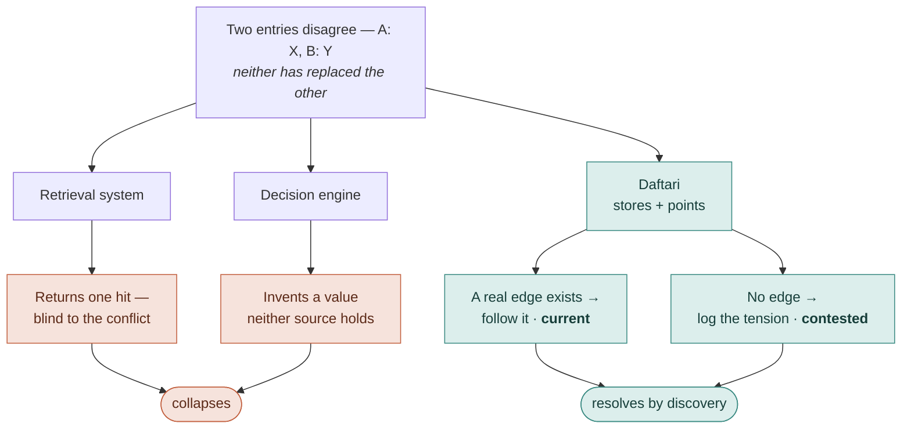

# Memory You Own, for a Model You Rent

*The argument behind Daftari. The README tells you what it is and how to run it;
this is why I built it.*

---

In a previous post I argued that [trust is a ledger, not a
feeling](/blog/trust-is-a-ledger-not-a-feeling-rethinking-control-in-agentic-ai):
in agentic systems, trust lives at the boundary where a reversible draft becomes
an irreversible commit, and you protect that boundary with invariants that force
the agent to quote its sources. Daftari is what happens when I point the same
idea at *memory* instead of *action*.

The question it answers is narrow and, I think, mis-answered everywhere else:
when an agent remembers something, who owns the memory, and what is the memory
allowed to do with a contradiction?

## Memory is becoming a feature of the model

Large language models are stateless. Each conversation starts from zero; what an
agent learns in one session evaporates at the end of it. So everyone is bolting
memory on. The part nobody says out loud is *where that memory lives* — and today
the answer is: inside the provider. ChatGPT memory. Claude projects. Copilot and
Recall. Gemini. Memory is becoming a feature of the model vendor.

That is not a neutral default. Memory is the stickiest lock-in there is. You can
swap a model in an afternoon; you cannot swap out months of accumulated context.
Whoever holds your memory holds you, and the incumbents have every incentive to
keep it sticky, proprietary, and non-portable. For them, a better memory is a
deeper moat.

## Rent the brain, own the memory

Run that incentive backwards and the design falls out. The model is the *rented*
part — stateless, swappable, obsolete in six months, improving too fast to
anchor your continuity to any one of them. The durable asset is the memory. So
draw the seam there: rent the brain, own the memory.

I mean *own* literally. Daftari is plain markdown on your disk, under git,
readable in any editor, rebuildable from source, queryable by any agent over an
open protocol. Portable across any model — not "agnostic," which is a vendor's
compatibility checkbox, but *portable*, which is your right to take it and leave.
The cognition is borrowed. The memory is yours, and it outlives whatever you plug
into it.

## It is not a second brain

The obvious objection: own your knowledge — haven't we heard this? Second brains,
PKM, the markdown-vault tools. No. Those are memory for a *human* to think with.
You are the retrieval engine. You browse, you link, you synthesize, and — this is
the part that matters — you are the one who catches the stale fact and notices
the two notes that contradict each other.

Daftari is memory for an *agent* to reason with: the persistence layer for a
consumer that acts on what it is handed and cannot sanity-check it first. The
substrate looks identical — markdown, links, local files. The purpose is
reversed, and the reversal moves the bar. A human reading their own notes
supplies judgment for free. A stateless reasoner can't. So every guarantee a
human reader would have supplied has to move into the memory itself.

## What the memory has to guarantee

If the consumer can't infer it, the memory has to carry it. Three things, and it
must collapse none of them into a convenient answer:

- **What's current.** When a fact changes, point to the latest source — but by
  following a real edge (a supersession), never by guessing.
- **What's grounded.** Every entry traces to where it came from. The memory never
  mints a value of its own; it stores and points, it does not invent.
- **What's contested.** When two facts genuinely disagree and neither has
  replaced the other, that disagreement is a first-class object — a *tension* —
  held open and surfaced, not flattened into a false resolution.

The reflex everywhere else is to collapse. Retrieval systems collapse by
returning one hit, blind to the conflict. Decision engines collapse by resolving
the conflict into a generated answer. Both hand the agent a clean story that
isn't true. Daftari refuses, because collapsing a contest into a winner is an act
of ownership — and ownership belongs to the principal, not the memory.

This is the same instinct as the [jugalbandi
protocol](/blog/jugalbandi-protocol-what-happens-when-you-force-ai-agents-to-argue),
one layer down. There I forced agents to argue rather than agree too early.
Here the memory keeps the argument legible instead of quietly settling it.

## The law

One line holds the whole system together:

> **A tension may never masquerade as a supersession.**

A supersession is resolution that *happened* — B replaced A; follow the pointer.
A tension is resolution that *hasn't* — A and B disagree, and the disagreement is
live. The cardinal sin is dressing the second up as the first: recording an open
disagreement as if it were settled. Daftari resolves only by discovery — an edge
that actually exists — and never by invention. I like this line because it is
falsifiable: you can point at a record and check whether it faked a resolution.

## The daftar

The name is not decoration. A *daftari* was the ledger-keeper in a trading
house, the person who maintained the *daftar* — the bound register where every
transaction was recorded, cross-referenced, and preserved. The daftar was not a
filing cabinet. Entries referenced earlier entries. Corrections were noted, not
erased. The ledger got more valuable the longer it was kept, because the
accumulated record revealed patterns no single entry could.

That discipline — corrections noted, not erased — is the entire thesis, three
centuries early. A ledger you can trust is one that never quietly overwrites its
own past. Supersession is the correction noted in the margin. Tension is the two
entries that disagree and are both left standing. The ledger-keeper did not get
to decide which trade really happened; he recorded faithfully and let the
merchant decide. Neither does Daftari.

## Honest assessment

The failure mode of this stance is abdication. A memory that forever answers
"these disagree, you figure it out" pushes all the work back onto a consumer that
*must* act — and for a machine that can't sit in ambiguity, "good luck" is not a
feature. Held loosely, Daftari collapses into one of two things: a second brain
that resolves nothing, or a worse decision engine that resolves badly.

So the identity lives in a narrow seam, and it has to be held precisely: resolve
what is *legitimately* resolved — by pointing, never minting — and preserve only
what is *genuinely* contested. Supersession does the resolving that is earned;
tension holds the rest. Lose that line and the thesis dies.

**Kill condition.** If, in real use, the contested set an agent actually needs to
act on is almost always trivially resolvable by recency or relevance — if holding
the tension never changes a decision a human or agent would have made anyway —
then non-collapse is a philosophical luxury, not a load-bearing property, and the
honest move is to admit the simpler systems were right. I am building the second
corpus to try to kill exactly this claim, not to confirm it.

## Why it belongs to the commons

This is a bet against where the industry is heading: proprietary, sticky,
resolving memory owned by the model vendor. By construction it cannot come from
the incumbents — it is against their interest. So it has to come from the commons.

That is why Daftari is MIT, public, and headed for a paper. The artifact in this
repo is a developer's tool, and most of the world will never run it directly.
That is fine. The thing meant to travel is the idea and its requirements: agent
memory should be owned, portable, and non-collapsing, where non-collapsing
decomposes into current, grounded, and contested, none of them flattened.
Daftari is the existence proof that those requirements are buildable. Others will
re-embody them in forms more people can use, and the idea will outlive this
implementation.

That is the whole ambition. Not to own the category — to put a true idea into the
commons and let it travel.
