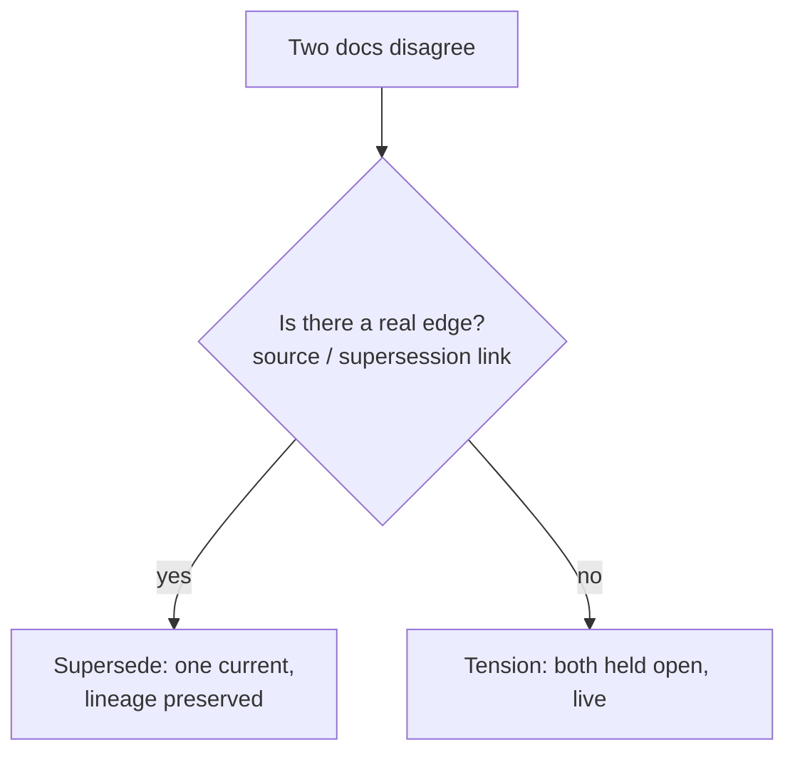

# Daftari README Restructure — Implementation Plan

> **For agentic workers:** REQUIRED SUB-SKILL: Use superpowers:subagent-driven-development (recommended) or superpowers:executing-plans to implement this plan task-by-task. Steps use checkbox (`- [ ]`) syntax for tracking.

**Goal:** Restructure `daftari/README.md` so it reads as a pitch + orientation (not a manual): add a grouped in-page TOC, collapse reference/config behind `<details>`, reorder into 5 groups, reframe the competitive table, add one Mermaid diagram, and remove banned adverbs — without deleting any information.

**Architecture:** Pure Markdown edits to a single file. Reference material stays *in the file* but folds into GitHub-native `<details>` blocks. Structural moves and prose edits are committed separately so the diff stays legible. Every task ends in a verification grep and a commit.

**Tech Stack:** Markdown, GitHub-Flavored Markdown (`<details>`, Mermaid code fences), `rg` for verification.

**Spec:** `daftari/docs/superpowers/specs/2026-07-31-daftari-readme-restructure-design.md` (currently held at `claude-home-base/workspace/work/2026-07-31-daftari-readme-restructure-design.md`).

**Working file:** `/Users/mihirwagle/projects/daftari/README.md` (779 lines, 26 `##` sections at start).

**Placement / branch:** An isolated worktree is ALREADY created (the main daftari
checkout is on an unrelated branch with untracked work — do not touch it):

- Worktree: `/Users/mihirwagle/projects/daftari-wt-readme`
- Branch: `docs/readme-restructure`, tracking `origin/main` (base 5fa3ffe)
- **Do all work in the worktree.** main is ruleset-protected → ship via PR.

Place the spec + plan on this branch first:

```bash
cd /Users/mihirwagle/projects/daftari-wt-readme
mkdir -p docs/superpowers/specs docs/superpowers/plans
cp /Users/mihirwagle/projects/claude-home-base/workspace/work/2026-07-31-daftari-readme-restructure-design.md \
   docs/superpowers/specs/2026-07-31-daftari-readme-restructure-design.md
cp /Users/mihirwagle/projects/claude-home-base/workspace/work/2026-07-31-daftari-readme-restructure-plan.md \
   docs/superpowers/plans/2026-07-31-daftari-readme-restructure.md
git add docs/superpowers/specs docs/superpowers/plans
git commit -m "docs: add README restructure design spec + plan"
```

---

## Baseline verification (run once, before Task 1)

- [ ] **Confirm the starting state matches the spec's assumptions.**

```bash
cd /Users/mihirwagle/projects/daftari-wt-readme   # the worktree, on branch docs/readme-restructure off origin/main
wc -l README.md                              # expect ~778
rg -n '^## ' README.md | wc -l               # expect 29 (see note)
rg -n '\bquietly\b' README.md                # expect 1 hit (~line 170)
rg -ni '\bsilent(ly)?\b' README.md           # expect ~3 hits
```

> **Section-count note (verified on origin/main):** `rg '^## '` returns **29**, but
> only **26 are real document sections**. The other 3 — `## Totals`,
> `## Broken cross-repo references`, `## Staleness` — are **sample-output content
> inside the Coherence audit code fence** (~lines 524/531/537). They are NOT
> sections: do not give them TOC entries, and do not treat them as movable sections
> in the reorder. They travel *with* the Coherence audit section and end up inside
> its `<details>` in Task 3. So the raw `^## ` count stays **29** throughout; the
> **real section count stays 26**.

Expected: counts as above. If they differ materially, STOP and re-read the README before proceeding — the plan's line references may have drifted.

---

## Task 1: Editorial tightening + banned-adverb sweep + diagram (in place, no reorder)

Do all *prose* changes while sections are still in their original positions (easier to locate). No section moves in this task.

**Files:**
- Modify: `README.md`

- [ ] **Step 1: Kill "quietly" and recast (not swap).**

In "Two kinds of knowledge" (~line 170), the sentence reads:
> "The same curation rules applied uniformly would either nag about every brainstorm or quietly trust every stale fact."

The README already uses "silent/silently" ~3× elsewhere, so do **not** swap in "silently." Recast, e.g.:
> "Applied uniformly, the same curation rules would either nag about every brainstorm or wave through every stale fact."

- [ ] **Step 2: Sweep the rest of the banned-adverb class.**

```bash
rg -ni '\b(quietly|seamlessly|effortlessly|simply)\b' README.md
```
For each hit, recast to remove the filler adverb (keep the meaning). Do NOT touch legitimate "silent-downgrade" / "Staleness? Silent" / "silently killed" — those carry meaning and were flagged as acceptable-in-place. Leave "just" alone unless it's a hedge.

- [ ] **Step 3: Add the contradiction-decision Mermaid diagram.**

Insert at the END of the "It remembers — it doesn't resolve for you" section — after its final paragraph (`... See [the manifesto](docs/manifesto.md) for the full argument.`, ~line 55) and BEFORE the next heading `## What it is` (~line 57). Do not wedge it between the blockquote law and the paragraphs that follow it. Block to insert:

````markdown

````

- [ ] **Step 4: Tighten the three dense visible blocks (do NOT collapse yet — collapsing is Task 3).**

Tighten prose only, keeping every fact:
- File format / valid-time explanation (~lines 229–240): reduce the 4-paragraph bitemporal walk to one tight paragraph in the visible body; the half-open-interval detail will be collapsed in Task 3, so leave a clean seam (a short lead sentence + the deep detail as a trailing block you can wrap later).
- "The vault as witness — and the wager layer" (~lines 612–627): tighten to the mechanic (confidence costs points: high=3 / medium=1 / low=0; a claim corrected or retired burns the stake, a claim surviving a TTL cycle earns credit). Leave the two kill-conditions as a trailing block for Task 3 collapse.
- OKF prose (~lines 314–343): light tighten only; the heavy collapse is Task 3.

- [ ] **Step 5: Verify no banned adverbs remain and the diagram is present.**

```bash
rg -ni '\b(quietly|seamlessly|effortlessly|simply)\b' README.md   # expect 0
rg -n 'mermaid' README.md                                          # expect 1
```

- [ ] **Step 6: Commit.**

```bash
git add README.md
git commit -m "docs(readme): tighten prose, drop banned adverbs, add contradiction diagram"
```

---

## Task 2: Reframe the competitive comparison table (in place)

**Files:**
- Modify: `README.md` — "How it compares" (~lines 425–433)

- [ ] **Step 1: Replace the AGENTS.md/RAG/Daftari table with the contradiction-axis table.**

Replace the existing table under "## How it compares" with:

```markdown
The real question a memory layer has to answer: **what happens when two facts
contradict?**

| What happens to a contradiction? | Systems |
|---|---|
| Invisible | AGENTS.md, RAG |
| Synthesis-overwrite (association only) | Mem0 (OSS), ChatGPT / Claude memory, Glean |
| New wins, old tagged-invalid | Zep / Graphiti, Sentra |
| Resolved by graph / majority-vote | Cognee, ElephantBroker |
| **Held open, live & queryable** | **Daftari** |

And the honest cost, since compounding isn't free:

| Who has to do the curation work? | |
|---|---|
| RAG | Nobody — retrieval only, zero authoring cost |
| AGENTS.md | One file, hand-maintained |
| **Daftari** | **An agent (or human) curates — the heaviest of the three, and the reason knowledge compounds** |
```

- [ ] **Step 2: Add the TOKI footnote directly beneath the tables.**

```markdown
> The nearest formal prior art is **TOKI** ([arXiv 2606.06240](https://arxiv.org/abs/2606.06240),
> with a [reference implementation](https://github.com/ZenAlexa/toki-bitemporal-memory)):
> a bitemporal operator algebra whose opt-in `await-confirmation` operator can hold a
> contradiction open. The line: TOKI resolves at write time (hold-open is one of four
> operators) and keeps the loser in an *archival* audit row; Daftari makes non-resolution
> the *default* and keeps both facts *live and queryable* in retrieval.
```

- [ ] **Step 3: Verify no corrected overclaim leaked in.**

```bash
rg -ni 'fleeing rung|market is fleeing|mem0 removed its graph' README.md   # expect 0
rg -n 'TOKI' README.md                                                     # expect 1
```
(Mem0's graph removal was OSS-only; that narrative must NOT appear.)

- [ ] **Step 4: Commit.**

```bash
git add README.md
git commit -m "docs(readme): reframe comparison around contradiction handling + honesty row + TOKI footnote"
```

---

## Task 3: Collapse reference/config tails into `<details>`

Apply the collapse rule: concept stays open, reference/config folds. The `<details>` pattern for every collapse:

```markdown
<details>
<summary><b>One-line summary of what's inside (▸ expand for full reference)</b></summary>

...the reference/config block moved verbatim here...

</details>
```

**Files:**
- Modify: `README.md`

- [ ] **Step 1: Collapse each reference tail (concept paragraph stays OPEN above the block).**

Wrap these blocks in `<details>` (keep the lead concept prose visible above each):
1. **Coherence audit** (biggest win): the CLI flags, `audit.yaml` full schema, exit-code table, and sample output (~lines 519–611). Keep the "what it detects" concept open.
2. **The tools**: the "Tool tiers" YAML block (~lines 127–150) and the full per-category tool enumeration (~lines 111–121). Keep the Attest/Believe/Witness prose open.
3. **File format**: the half-open-interval / valid-time deep dive (the trailing block left from Task 1 Step 4).
4. **Access control**: the roles YAML example (~lines 177–194).
5. **Server mode**: the auth config YAML + fail-loud posture detail (~lines 365–389).
6. **Storage backing**: the config YAML + sync semantics (~lines 397–423).
7. **Adopting a vault + OKF**: the import/export field-mapping paragraphs (~lines 264–348).
8. **Witness/wager**: the two kill-conditions detail (trailing block from Task 1 Step 4).

**Evaluated and NOT collapsed** (reconciles the spec's `▸` on these): **Tension
Court** and **Belief archaeology** each carry only short `bash` example blocks, not
heavy config/schema tails — their bodies are concept prose that stays open. Leaving
them open keeps the block count at 8. If, on inspection, either section's CLI
examples read as reference bloat, collapsing just the example block is acceptable —
bump the expected `<details>` count accordingly in the greps below.

- [ ] **Step 2: Verify collapsed content is still present (nothing deleted).**

```bash
rg -n 'audit.yaml' README.md                          # audit schema still in file
rg -n 'transport_security|external-git-dir|storage:' README.md   # server/storage config still present
rg -c '<details>' README.md             # expect 8
rg -c '</details>' README.md            # expect 8 (balanced)
```

- [ ] **Step 3: Commit.**

```bash
git add README.md
git commit -m "docs(readme): collapse reference and config tails into <details>"
```

---

## Task 4: Reorder sections into the 5 groups (pure move — no prose edits)

This is a structural move only. Do not edit wording here; keeping it a pure move keeps the diff reviewable.

**Target order (headings unchanged; "(quickstart)" is NOT a heading rename):**

1. **Why Daftari:** Rent the brain, own the memory → Not a second brain → It remembers, it doesn't resolve (+ diagram) → How it compares
2. **Concepts:** What it is → The four layers → Two kinds of knowledge → File format
3. **The rituals:** The tools → Circadian memory → Tension Court → The principal interview → Belief archaeology → The vault as witness / wager layer → Coherence audit
4. **Running it:** Access control → Server mode → Storage backing → Adopting a vault + OKF
5. **Reference / meta:** What's not in v1 → Development → Documentation → Integrations → Privacy → License

Key moves: "How it compares" up into group 1; "Access control" down into group 4; "Coherence audit" earlier into group 3.

- [ ] **Step 1: Move sections into the order above.** Cut/paste whole sections (heading through last line before next `##`). Optionally add a lightweight group divider comment (`<!-- Why Daftari -->`) above each group's first section — no visible headers needed since the TOC carries the grouping.

- [ ] **Step 2: Verify no section was lost in the move.**

```bash
rg -n '^## ' README.md | wc -l    # expect 29 (26 real + 3 sample-output; same as baseline)
rg -c '<details>' README.md       # still 8 (nothing dropped in the move)
```

- [ ] **Step 3: Commit.**

```bash
git add README.md
git commit -m "docs(readme): reorder sections into pitch → concepts → rituals → config → meta"
```

---

## Task 5: Add the grouped in-page TOC

**Files:**
- Modify: `README.md` — insert after the opening three paragraphs (after the "A cortex, not a clipboard." intro, before "## Rent the brain, own the memory").

- [ ] **Step 1: Insert the grouped TOC.** Anchor links are GitHub's auto-slugs (lowercase, spaces→hyphens, punctuation dropped; em-dash "—" drops out — verify each). Example skeleton (fill anchors to match actual headings):

```markdown
## Contents

**Why Daftari** — [Rent the brain, own the memory](#rent-the-brain-own-the-memory) · [Not a second brain](#not-a-second-brain) · [It remembers, it doesn't resolve](#it-remembers--it-doesnt-resolve-for-you) · [How it compares](#how-it-compares)

**Concepts** — [What it is](#what-it-is) · [The four layers](#the-four-layers) · [Two kinds of knowledge](#two-kinds-of-knowledge) · [File format](#file-format)

**The rituals** — [The tools](#the-tools) · [Circadian memory](#circadian-memory) · [Tension Court](#tension-court) · [The principal interview](#the-principal-interview) · [Belief archaeology](#belief-archaeology) · [The vault as witness](#the-vault-as-witness--and-the-wager-layer) · [Coherence audit](#coherence-audit)

**Running it** — [Access control](#access-control) · [Server mode](#server-mode-self-hosted) · [Storage backing](#storage-backing) · [Adopting a vault + OKF](#adopting-an-existing-vault)

**Reference** — [What's not in v1](#whats-not-in-v1) · [Development](#development) · [Documentation](#documentation) · [Integrations](#integrations) · [Privacy](#privacy) · [License](#license)
```

- [ ] **Step 2: Verify every anchor resolves.** For each `#anchor` in the TOC, confirm a heading slugifies to it:

```bash
# List actual heading slugs to compare against the TOC anchors by eye:
rg -n '^#{2,3} ' README.md
```
Manually confirm each TOC target exists. (Anchor slugs must match exactly, including the double-hyphen from em-dashes.)

- [ ] **Step 3: Commit.**

```bash
git add README.md
git commit -m "docs(readme): add grouped in-page table of contents"
```

---

## Task 6: Final verification

- [ ] **Step 1: Information-preservation + hygiene sweep.**

```bash
cd /Users/mihirwagle/projects/daftari-wt-readme
rg -n '^## ' README.md | wc -l                                   # 29 raw (26 real sections intact + 3 sample-output)
rg -ni '\b(quietly|seamlessly|effortlessly|simply)\b' README.md  # 0
rg -c '<details>' README.md; rg -c '</details>' README.md        # 8 and 8
rg -n 'audit.yaml|transport_security|external-git-dir' README.md # reference still present
rg -n 'TOKI|await-confirmation' README.md                        # footnote present
rg -ni 'market is fleeing|mem0 removed its graph' README.md      # 0 (corrected overclaim absent)
```

- [ ] **Step 2: Render check.** Open the branch's README on GitHub (push the branch and view, or use a local GFM preview) and confirm:
  - The grouped TOC renders and every link jumps correctly.
  - The Mermaid diagram renders (GitHub renders `mermaid` fences natively).
  - All 8 `<details>` blocks are collapsed by default and expand on click.

- [ ] **Step 3: Open the PR** (main is ruleset-protected).

```bash
git push -u origin docs/readme-restructure
gh pr create --title "docs: restructure README (TOC, collapse, reorder, competitor reframe)" \
  --body "$(cat <<'EOF'
## Summary
- Grouped in-page TOC (pitch → concepts → rituals → config → meta)
- Reference/config folded into 8 <details> blocks; no information removed
- Reordered so differentiation precedes configuration
- Reframed "How it compares" around contradiction handling + honesty row + TOKI footnote (Mem0 graph-removal corrected to OSS-only; Cognee promoted to first-class)
- One Mermaid contradiction-decision diagram
- Banned-adverb sweep

Spec: docs/superpowers/specs/2026-07-31-daftari-readme-restructure-design.md
EOF
)"
```

Note: the `review` CI check historically reds on a missing API key (infra, not this change) — don't block on it.

---

## Notes for the implementer

- **No information may be deleted** — only moved, collapsed, or tightened. Every `rg` for reference content must still return hits after collapsing.
- **Keep moves and edits in separate commits** (Tasks are ordered for this).
- **Anchor slugs are the fiddly part** — GitHub drops punctuation and turns "—" into a double hyphen. Verify each TOC link against the rendered page, not by eye alone.
- Reference skills with @ as needed: @superpowers:executing-plans or @superpowers:subagent-driven-development to run this.
