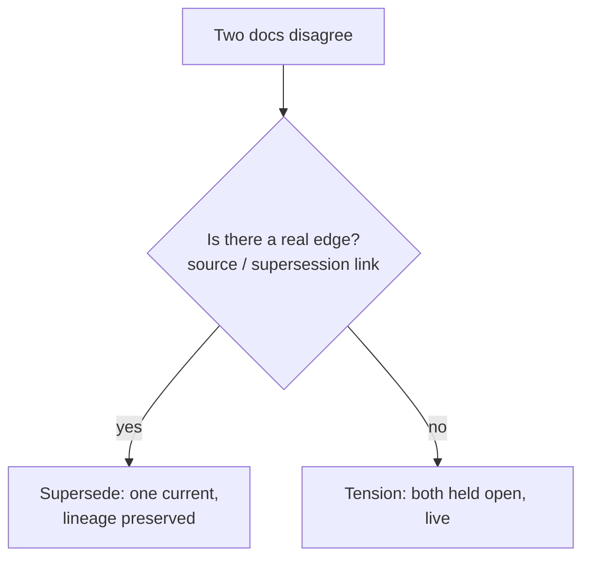

# Daftari README Restructure — Design

**Date:** 2026-07-31
**Author:** Mavaali (agent:mavaali), with Mihir
**Status:** Draft for review
**Intended home:** `daftari/docs/superpowers/specs/2026-07-31-daftari-readme-restructure-design.md`
(held in `claude-home-base/workspace/work/` pending Mihir's placement call, given
daftari's live multi-branch/worktree state; place on a fresh branch off
`origin/main`).

## Problem

`daftari/README.md` is ~780 lines across **26 top-level sections**. It reads as
"text-heavy" because it does **two jobs at once**: a marketing pitch *and* a full
reference manual (complete `audit.yaml` schema, exit-code tables, every CLI flag,
OKF import/export semantics, server auth + storage config). The dual role is the
root cause of the length, not weak writing.

The differentiated feature sections (Tension Court, belief layer, witness/wager,
coherence audit, principal interview, belief archaeology) all sit 600+ lines
down, so a reader who scrolls blind never discovers what makes Daftari different.
There is no in-page table of contents. (GitHub renders an auto-TOC in the file
header, but it is hidden behind a click most readers never notice — and for a
tool whose section list *is* part of the pitch, that menu can't do the marketing
work an inline TOC does.)

## Audience (who the README is actually for)

Not the runtime agent consuming Daftari — that agent calls `tools/list` and gets
schemas, never reading the README or `docs/`. The README serves the
**repo-surveying reader**: a human evaluating adoption, or a coding agent
(Cursor/Claude Code) pointed at the repo to understand it. That reader stays in
the README and will not chase relative links into `docs/`. Therefore **nothing
relocates out of the README** — density reduction does all the work.

## Goals

1. Add an in-page, **grouped** table of contents.
2. Cut perceived length without losing information: collapse reference/config
   behind `
`, tighten visible prose, add one diagram.
3. Reorder so differentiation comes before configuration.
4. Modernize + de-risk the competitive comparison (honest, current, footnoted).

## Non-goals

- Moving content out to `docs/` (see Audience).
- Decorative visuals (emoji headers, hero images) — this audience reads a serious
  tool; ornamentation cheapens it.
- Rewriting the manifesto/voice sections that already work.

## Design

### 1. The collapse rule (the crux)

**Open by default = concept & differentiation. Collapsed `
` = reference &
config.** The test for every section: *"why you'd care" (stays open) vs. "how you'd
configure it" (folds).*

- **Stays open:** intro/manifesto framing, "rent the brain / own the memory,"
  "not a second brain," "it remembers — it doesn't resolve," the four layers, two
  kinds of knowledge, and the *existence + concept* of each differentiated feature
  (Tension Court, `vault_canon` belief layer, witness/wager, circadian memory,
  principal interview, belief archaeology).
- **Folds into `
`:** full `audit.yaml` schema, exit-code table, all CLI
  flags, OKF import/export field-mapping, server auth config, storage-backing
  config, tool-tier YAML.
- **Split sections:** where a section is both (e.g. Coherence Audit = one good
  concept paragraph + ~90 lines of flags/schema/exit-codes/sample-output), the
  concept stays open and the reference tail collapses. This split is where most
  of the length disappears.

`
` renders natively on GitHub — no plugin, no build step.

### 2. Section order + grouped TOC

The 26 flat sections become **5 TOC groups**. Two moves: pull differentiation
*up*, push config *down*. `▸` marks sections whose reference tail collapses.

**Why Daftari** (pitch, all open)
- Rent the brain, own the memory · Not a second brain · It remembers, it doesn't
  resolve · **How it compares** *(moved up from mid-page — the reframed
  contradiction table is differentiation and belongs near the top)*

**Concepts**
- What it is (quickstart) · The four layers · Two kinds of knowledge · File
  format ▸ *(collapse the full field reference + valid-time deep dive)*

**The rituals** (differentiated features)
- The tools ▸ *(keep Attest/Believe/Witness prose open; collapse tool-tiers + the
  full 27-tool list)* · Circadian memory · Tension Court ▸ · The principal
  interview · Belief archaeology ▸ · The vault as witness / wager layer ·
  Coherence audit ▸ *(biggest single win — flags/schema/exit-codes/sample-output
  collapse to one concept paragraph + expander)*

**Running it** (config, mostly folded)
- Access control ▸ · Server mode ▸ · Storage backing ▸ · Adopting a vault + OKF ▸

**Reference / meta** (open, short)
- What's not in v1 · Development · Documentation · Integrations · Privacy · License

The grouped TOC sits right after the opening three paragraphs. Grouping (not a
flat 26-item dump) keeps the TOC from being as long as the doc it indexes.

**Move notes (for the diff reviewer — these are intentional, not accidental
losses):**
- *"What it is (quickstart)"* — the "(quickstart)" is a TOC annotation only; do
  **not** rename the section heading (it stays "What it is").
- **Access control** currently sits early (before OKF/Server/Storage); it moves a
  long way *down* into "Running it." Large reposition, on purpose.
- **Coherence audit** currently sits *after* the differentiated features; it moves
  *earlier* into "The rituals." So "push config down" has two exceptions — the
  guiding principle is the group semantics (pitch → concepts → rituals → config →
  meta), not a strict top-to-bottom shove.

### 3. Reframed competitive comparison

Replace the current AGENTS.md / RAG / Daftari table (the 2024 framing; an
all-green Daftari column against all-red rivals — reads as a sales grid). The real
2026 competitors are memory products. New single-axis table:

**"What happens to a contradiction?"**

| Handling | Systems |
|---|---|
| Invisible | AGENTS.md, RAG |
| Synthesis-overwrite (Rung 1, association) | Mem0 OSS, ChatGPT/Claude memory, Glean |
| New wins, old tagged-invalid | Zep/Graphiti, Sentra |
| Resolved by graph / majority-vote | Cognee, ElephantBroker |
| **Held open, live & queryable** | **Daftari** |

Plus two honesty elements (transparency was Mihir's explicit driver here):

- **A "who has to do the work?" row** where Daftari is honestly the *heaviest* —
  RAG has zero authoring cost, AGENTS.md is one file. A reader trusts a comparison
  that admits a weakness.
- **A one-line TOKI footnote.** TOKI (arXiv 2606.06240, Jun 2026) is the nearest
  *formal* prior art: a bitemporal operator algebra with an opt-in
  `await-confirmation` operator that holds a contradiction open, plus a reference
  implementation (`github.com/ZenAlexa/toki-bitemporal-memory`) and a LoCoMo eval.
  The footnote cites it and draws the line: *opt-in operator + archival audit rows*
  vs. *Daftari's default non-resolution with live, queryable tensions.* TOKI
  explicitly disclaims cross-system superiority, so there is no benchmark exposure.

**Corrections baked in (verified 2026-07-31):**
- Mem0's graph removal is **OSS-only**; the hosted platform kept graph memory. Do
  **not** write "the market is fleeing Rung-2" — it's an OSS-vs-paid split.
- Cognee is a **first-class competitor** now, not merely ElephantBroker's substrate.

Full competitive backing: `mavaali-vault/competitive-intel/daftari-memory-competitors.md`.

### 4. One diagram (Mermaid, native on GitHub)

The **contradiction decision flow**, placed right after "It remembers — it doesn't
resolve":

One picture for "resolve only by discovery, never by invention." Hold the optional
second (four-layers) diagram — the layers table already works; restraint keeps the
page serious.

### 5. Editorial tightening (visible prose only)

- **File format / valid-time:** keep one tight paragraph open, collapse the
  half-open-interval deep-dive.
- **OKF:** hardest collapse on the page (two heavy export/import paragraphs).
- **Witness / wager layer:** tighten to the mechanic (confidence costs points;
  a wrong claim burns stake) + collapse the kill-conditions detail.
- **Banned-adverb sweep:** kill "quietly" ("...would *quietly* trust every stale
  fact," Two kinds of knowledge) and sweep the same class
  (seamlessly/effortlessly/simply/just-as-hedge). Note: "silently" is a better
  replacement than "quietly" but is **not** a free find-and-replace — the README
  already uses "silent/silently" ~3x ("fail-loud, never silent-downgrade,"
  "Staleness? Silent," "silently killed"). Recast rather than swap in another
  "silently"; watch local density.

## Success criteria

- In-page grouped TOC present; every group links resolve.
- Rendered README fits the differentiation story (pitch + all ritual concepts +
  the comparison) above the fold-equivalent, with no `
` expanded.
- All reference/config still present in the file (greppable), just collapsed.
- Competitive table is current, carries the honesty row + TOKI footnote, and
  contains none of the two corrected overclaims.
- No banned adverbs remain.
- No information deleted — only moved, collapsed, or tightened.

## Risks / open questions

- **Reorder churn:** moving "How it compares" up and sinking config produces a
  large diff. Mitigate by doing structure-move and prose-edit as separable commits
  so review is legible.
- **`
` + Mermaid rendering:** both are GitHub-native, but verify in the
  PR preview (some code hosts differ).
- **Competitive freshness:** the vault backing has a 90-day TTL; re-verify before
  any future major edit.
