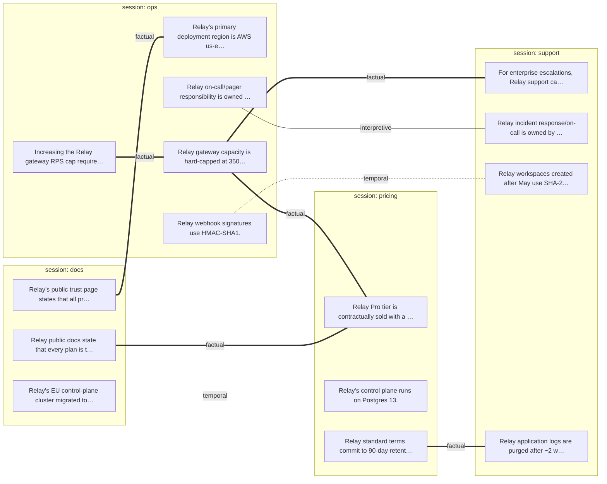

# Demo: Daftari compiles a LangMem store it did not create

**The claim, one paragraph.** LangMem's own consolidation ran first, with its
own prompt promising to "remove incorrect or redundant memories while
maintaining internal consistency." It merged 4 of 5 planted near-duplicates
(its job) and caught zero of the planted contradictions. Worse: given a shared
namespace, it silently deleted one side of real conflicts and kept a fabricated
fact. Daftari then read the same Postgres store through a read-only role,
compiled the memories into claim notes with full provenance, and an agent pass
using daftari's tools logged 9 tensions with 0 false positives — including a
4-way capacity contradiction spanning four sessions that no single LLM
judgment ever saw whole. Dedup is not epistemics.

## Prerequisites (once)

```bash
# at repo root
npm install && npm run build

# in integrations/langgraph-store-demo
uv venv --python 3.12 .venv
uv pip install --python .venv/bin/python langmem langgraph \
  langgraph-checkpoint-postgres "psycopg[binary]" langchain-openai mcp
cat > .env <<'EOF'
OPENROUTER_API_KEY=sk-or-...   # LLM calls (LangMem manager + judge), gpt-5.2
OPENAI_API_KEY=sk-...          # embeddings only (text-embedding-3-small)
EOF
```

Exact pins recorded in [VERSIONS.md](VERSIONS.md). Python 3.13+ will not
resolve LangMem — pin 3.12.

## The three commands

```bash
docker compose up -d                        # 1. Postgres 16 + pgvector + read-only role
.venv/bin/python fixtures/populate.py all   # 2. LangMem populates + consolidates (its best shot)
./run_demo.sh                               # 3. daftari imports, detects, asserts, renders
```

## Expected output

Command 2 ends with (numbers vary slightly per run — extraction is an LLM):

```
verify: all plants landed raw and survived v1 (import source); v2 destroyed
1 plant(s): ['PC3a']; near-dup merge rate 4/5 (acceptance >=4)
```

Command 3 ends with:

```
PASS: 3 pairwise linked; n-way is one 5-doc component; false positives: 0/9
# (repro runs vary slightly: 9-10 tensions, 0-1 borderline filler flags — see RESULTS.md)
wrote tension-graph.mmd
```

## The graph

Sessions disagree at a glance — the factual (═══) component in the middle
spans all four sessions; that structure exists in no single memory and no
single LLM call:



Full numbers, per planted category: [RESULTS.md](RESULTS.md).

## What this demo is NOT

- Not a claim that daftari's LLM judge is smarter than LangMem's. Same model
  (gpt-5.2), same one-pair-at-a-time retrieval scope. The difference is
  architectural: an append-only tension ledger + connected components versus
  in-place overwrites.
- Not write-back. The adapter is read-only by construction (read-only Postgres
  role AND a session forced READ ONLY). LangGraph keeps writing; daftari reads.
- Not org scoping, not multi-writer, not a ContextVault adapter. Separate PRs.
